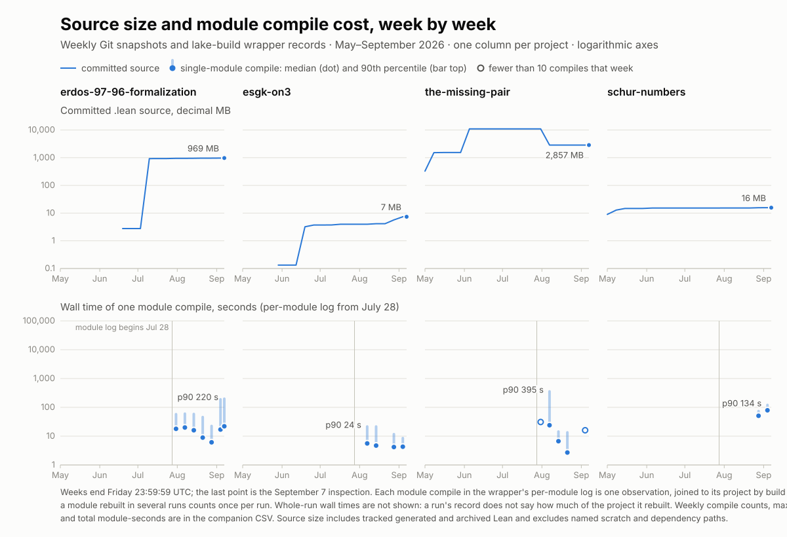

# Faster Lean verification with controlled memory and CPU

**Engineering report by Adam McKenna, prepared for prove2.me (Kunal Marwaha) — 7 September 2026**

Over the past four months we have built and repeatedly rebuilt several large Lean 4 developments: general formalization alongside generated certificate banks that run to thousands of modules and gigabytes of source. This report collects what that work taught us about making Lean verification faster while keeping memory and CPU under control, and offers it to prove2.me as a set of engineering options to evaluate against the existing service.

The report has two parts because the lessons fall into two layers with different owners. [Part I](#part-i--lean-proof-and-code-engineering) is for proof authors: imports, tactics, representations, checker algorithms, sharding, compiler attributes, and the trust policy for native computation. [Part II](#part-ii--system-build-and-agent-operations) is for platform and tooling owners: caches, resource limits, host protection, build telemetry, agent coordination, and compiler-toolchain experiments. Shared context comes first: the projects, their size, and the weekly relationship between source size and module compile cost. The [appendix](#appendix--scope-evidence-and-coverage) records scope, evidence, and coverage, and the [references](#references) list every source cited.

Three qualifications apply to every figure and are not repeated at each one. Every measurement is historical: it was recorded during project work on its own toolchain, machine load, and cache state, and no fresh benchmark was run for this report. Ratios from different measurements are not combined into an overall speedup; the 31× reduction in one certificate artifact and the roughly 7–10× lower local shard rebuild latency, for example, measure different things. Faster compilation and successful certificate checking are never treated as mathematical proof closure.

Prove2Me already provides built-in theorem search, shared verification, asynchronous submissions, and pinned Lean/Mathlib environments; at review time its FAQ lists Lean 4.33.1, 4.30.0, and 4.29.0-rc3 and requires imports to stay within one environment. Nothing here claims those facilities are missing, and our older measurements must be reproduced on those environments before adoption. Some repository links require access; the findings and qualifications are included in the text so the report remains readable without it. [Prove2Me FAQ](https://prove2.me/faq)

## Project context: workloads, size, and compile cost

Our portfolio combines general mathematical formalization with large finite computations and generated certificate replay. The latter can produce thousands of Lean modules and gigabytes of source even when the reusable checker is small. Other projects have hundreds of proof modules but comparatively little generated data. That difference drives import costs, elaboration pressure, invalidation, and the usefulness of sharding.

The scale comparisons below use **committed `.lean` paths and their Git blob bytes**, excluding paths containing the named scratch/worktree/dependency components specified below. This is a reproducible path filter, not a detector for every possible vendoring convention. It retains generated and archived Lean where those are tracked, so the results are inventories rather than the current theorem's import closure. Sizes use decimal MB/GB unless explicitly labeled MiB/GiB. Raw certificate files, generated Lean, and compiled `.olean` artifacts are separate layers and must not be added together as if they measured the same thing.

### Relative codebase size

| Project and workload | Committed Lean files | Committed Lean source | Inspected revision / qualification |
|------------------------------------------|--------:|----------:|--------------------------------------|
| **the-missing-pair** — finite-magma implication research, including E677 → E255 and generated SAT-certificate replay | 16,433 | **2,856.84 MB** | [9b76827c](https://github.com/flound1129/the-missing-pair/tree/9b76827c); generated terms dominate. |
| **erdos-97-96-formalization** — convex-point-set formalization and finite incidence/certificate banks | 18,332 | **969.23 MB** | [a4f1ff107](https://github.com/mysticflounder/erdos-97-96-formalization/tree/a4f1ff107); includes a large tracked attic, detailed below. |
| **erdos-98** — distinct-distance formalization/scaffolding and finite-field certificate replay | 14,178 | **706.06 MB** | [25954306](https://github.com/mysticflounder/erdos-98/tree/25954306); a finite replay bank. |
| **erdos-97-96** — earlier combined P97/P96 development and bridge certificates | 549 | **52.58 MB** | [10b0c7a](https://github.com/mysticflounder/erdos-97-96/tree/10b0c7a); historical sibling, not additional independent proof coverage. |
| **schur-numbers** — modular Schur formalization and finite residue/certificate packages | 7,634 | **15.71 MB** | [792a1de](https://github.com/flound1129/schur-numbers/tree/792a1de); many small generated shards. |
| **esgk-on3** — general-position distance-energy reductions and fixed-A gap research | 483 | **7.38 MB** | [d1076d7](https://github.com/flound1129/esgk-on3/tree/d1076d7); Lean reductions and solver-side finite artifacts are separate. |
| **lean-formalizations** — reusable/general geometric formalization modules | 194 | **4.66 MB** | `b7cc548`; a smaller source tree with substantive proof-module sharding. |

The formalization distinction matters: its main `lean/` tree accounts for **6,533 files / 127.39 MB**, while the retained `attic/` contributes **11,777 / 841.74 MB**. The filtered inventory excludes another **6,485 scratch-path files / 489.39 MB**. Calling the unfiltered 24,817-file checkout the active proof library would substantially overstate it. Even the main `lean/` count is not a measured live import closure.

File counts also conceal representation differences: Schur's roughly 7,600 small files occupy only about 15.7 MB, whereas the-missing-pair's roughly 16,400 occupy 2.86 GB. Module count alone is therefore a poor description of these workloads.

The recorded compile cost is similarly broad. In the per-module log, the median wall time of a single module compile ranged from **4 seconds** (esgk-on3) to **56 seconds** (Schur) by project, while the slowest single module in the formalization took **4h11m05s**. The [timing section in Part II](#what-the-recorded-compile-times-actually-show) uses module durations as the cost measure. Whole-run wall times are not reported as statistics: a run's record does not say how much of the project it rebuilt, and the log holds no cold full build of any project. Nothing here is a cold-build comparison or an isolated speedup.

### Source size and module compile cost, week by week

The graph places two weekly series side by side for the four projects that have global `lake-build` wrapper telemetry. The top row is filtered committed Lean source, sampled **weekly from May 1 through September 4** plus the September 7 inspection; it includes generated certificate banks and archived Lean, not raw certificate bytes or active proof coverage. The bottom row is, for each week from July 28, the median and 90th percentile of the wall time of each **single module compile** in the wrapper's per-module log, joined to its project through the shared build ID. Whole-run wall times are deliberately absent. Every recorded run, with or without a target argument, rebuilt only what had changed, and the run record does not say how much that was: the median no-target `lake build` on the formalization recompiled 18 modules of a tree with about 6,500 files. A median over such runs measures the size of recent edits, not compile cost. Both rows use logarithmic axes; each vertical decade means 10×. erdos-98 is in the size table above but has no wrapper telemetry, so it is not plotted.



[Open the graph](assets/lean-source-and-build-time-weekly-2026-09-07.svg) · [Weekly source file counts, bytes, and revisions (CSV)](assets/lean-source-growth-weekly-2026-09-07.csv) · [Weekly module compiles, median, p90, maximum, and total module-seconds (CSV)](assets/lean-module-compile-weekly-2026-09-07.csv)

Module compile cost does not track source size. Across the weeks with module records, committed source changed by under 5% for the formalization and Schur. The formalization's weekly median for a single module compile stayed between 6 and 22 seconds from July 28 onward. Its 90th percentile was 51–67 seconds through August 21, fell to 25 seconds in the week ending August 28, and rose to 210–220 seconds in the two September weeks, which contain the four-hour erased-certificate compiles of September 3 and September 5. Weekly module compiles fell from 11,247 in the week ending July 31 to 1,171 in the week ending August 28, then returned to 3,766 and 2,744 in September. esgk-on3's source grew by about 80% from mid-August while its module median stayed at 4–6 seconds. the-missing-pair's module compiles concentrate in two August weeks: a 395-second 90th percentile in the week of the August 3 E677 build, then 16 seconds the week after. Schur's two weeks of module records have medians of 51 and 79 seconds. These are observations of a changing task mix, not a controlled test of source size against compile cost. Hollow markers flag weeks with fewer than ten compiles.

Each weekly cutoff is **Friday 23:59:59 UTC**. We select the latest eligible committer timestamp on the inspected revision's first-parent history; the final point uses the pinned inspection revision. This reconstructs committed branch snapshots, not historical working trees or uncommitted files. A dash means no eligible prior history, not zero.

<details>
<summary>Weekly values: Lean files / decimal source MB</summary>

| UTC snapshot | the-missing-pair | P97/P96 formalization | erdos-98 | schur-numbers | esgk-on3 |
|---|---:|---:|---:|---:|---:|
| 2026-05-01 | 675 / 327.85 | — | — | 5,675 / 8.98 | — |
| 2026-05-08 | 8,076 / 1521.58 | — | — | 7,196 / 12.86 | — |
| 2026-05-15 | 8,136 / 1538.30 | — | 9 / 0.01 | 7,418 / 14.74 | — |
| 2026-05-22 | 8,137 / 1538.50 | — | 49 / 0.96 | 7,418 / 14.74 | — |
| 2026-05-29 | 8,137 / 1538.50 | — | 78 / 2.16 | 7,418 / 14.74 | 12 / 0.13 |
| 2026-06-05 | 19,398 / 10934.19 | — | 82 / 2.28 | 7,505 / 15.19 | 12 / 0.13 |
| 2026-06-12 | 19,398 / 10934.19 | — | 13,981 / 704.26 | 7,505 / 15.19 | 12 / 0.13 |
| 2026-06-19 | 19,398 / 10934.19 | 94 / 2.77 | 14,139 / 705.20 | 7,505 / 15.19 | 51 / 3.21 |
| 2026-06-26 | 19,398 / 10934.19 | 94 / 2.77 | 14,178 / 706.06 | 7,508 / 15.21 | 57 / 3.71 |
| 2026-07-03 | 19,398 / 10934.19 | 94 / 2.77 | 14,178 / 706.06 | 7,508 / 15.21 | 57 / 3.71 |
| 2026-07-10 | 19,398 / 10934.19 | 13,034 / 924.11 | 14,178 / 706.06 | 7,508 / 15.21 | 58 / 3.73 |
| 2026-07-17 | 19,441 / 10944.84 | 13,852 / 931.18 | 14,178 / 706.06 | 7,508 / 15.21 | 70 / 3.97 |
| 2026-07-24 | 19,441 / 10944.84 | 13,897 / 931.89 | 14,178 / 706.06 | 7,508 / 15.21 | 70 / 3.97 |
| 2026-07-31 | 19,441 / 10944.84 | 15,951 / 943.65 | 14,178 / 706.06 | 7,508 / 15.27 | 70 / 3.97 |
| 2026-08-07 | 16,378 / 2856.22 | 16,415 / 947.43 | 14,178 / 706.06 | 7,508 / 15.27 | 70 / 3.97 |
| 2026-08-14 | 16,433 / 2856.84 | 16,859 / 952.71 | 14,178 / 706.06 | 7,508 / 15.27 | 83 / 4.14 |
| 2026-08-21 | 16,433 / 2856.84 | 17,048 / 960.26 | 14,178 / 706.06 | 7,508 / 15.27 | 83 / 4.14 |
| 2026-08-28 | 16,433 / 2856.84 | 17,135 / 961.65 | 14,178 / 706.06 | 7,624 / 15.62 | 281 / 5.69 |
| 2026-09-04 | 16,433 / 2856.84 | 18,235 / 966.49 | 14,178 / 706.06 | 7,634 / 15.71 | 483 / 7.38 |
| 2026-09-07 | 16,433 / 2856.84 | 18,332 / 969.23 | 14,178 / 706.06 | 7,634 / 15.71 | 483 / 7.38 |

MB values are rounded to two decimals here; the CSV preserves exact bytes and the revision for every populated point. A flat segment means the selected Lean inventory is unchanged, not that no research or solver work occurred.

</details>

<details>
<summary>Weekly single-module compile values: compiles / median s / p90 s</summary>

| Week ending (UTC) | P97/P96 formalization | esgk-on3 | the-missing-pair | schur-numbers |
|---|---:|---:|---:|---:|
| 2026-07-31 | 11247 / 18 / 64 | — | 1 / 31 / 31 | — |
| 2026-08-07 | 7519 / 20 / 67 | 32 / 5.6 / 24 | 2769 / 24 / 395 | — |
| 2026-08-14 | 5279 / 16 / 65 | 46 / 4.7 / 24 | 3353 / 6.7 / 16 | — |
| 2026-08-21 | 1861 / 8.9 / 51 | — | 10 / 2.7 / 15 | — |
| 2026-08-28 | 1171 / 6.1 / 25 | 715 / 4.2 / 13 | — | 1851 / 51 / 82 |
| 2026-09-04 | 3766 / 17 / 210 | 492 / 4.3 / 9.5 | 1 / 16 / 16 | 522 / 79 / 134 |
| 2026-09-11 | 2744 / 22 / 220 | — | — | — |

Weeks are the same Friday cutoffs; the week ending September 11 contains only September 5–7 and is plotted at September 7. Module rows are joined to a project through the shared `build_id`; each row is one compile of one module, so a module rebuilt in ten runs contributes ten rows. The CSV also records each week's maximum and total module-seconds.

</details>

The generated-bank history explains several discontinuities:

- **the-missing-pair:** generated `E677/Generated` source expanded from **653 files on May 2** to **8,013 on May 5**, then **16,293 files / about 2.85 GB** at the current revision. The broader tree exceeded 10.9 GB before the August 2 cleanup removed 3,343 tracked Lean files; net of additions in the same week, the weekly inventory fell by 3,063 files. That deletion is a repository-size change, not a compiler speedup. The current tree also retains roughly **532 MB** of 1,856 JSON/CNF/DRAT/LRAT/output files, a separate mixed solver-data inventory. Anchors: `5d259d1f`, `1c000006`, [f13e4190](https://github.com/flound1129/the-missing-pair/commit/f13e4190), `9b76827c`.
- **P97/P96 banks:** the formalization rose from **94 files / 2.77 MB on June 29** to **12,616 / 867.29 MB on July 7**. Its July 9 census separately recorded **345 raw certificate JSON files / 1.03 GiB**, as well as the expanded Lean bank and attic. In the earlier erdos-97-96 sibling, generated source briefly reached about **841 MB on June 6**, then fell to about **52 MB** after bridge cleanup/compaction. These are related inventories, not independent quantities to sum. [July census](https://github.com/mysticflounder/erdos-97-96-formalization/blob/a4f1ff107/docs/general-n-certificate-bank-mining-2026-07-09.md#L96), expansion `41321179f`, sibling `9996cbad` / `cd134c0`.
- **erdos-98:** a degree-6 certificate package took the tree from **82 files / 2.28 MB** (June 6, `92bd8725`) to **13,882 / 668.58 MB** in `504038f7` on June 7, reaching **13,981 / 704.26 MB** by the end of that day. The July mining notes describe about **100 GB of raw scratch data**, far beyond the tracked Lean source. A compact certificate manifest records an **895.84 MB full proof**, a **9.05 MB compact proof**, and a **6.68 MB row package**. Those are different representation layers; the compact proof alone is about 99× smaller, not 99× faster. [Compact manifest](https://github.com/mysticflounder/erdos-98/blob/25954306/docs/problem-98-b4-linear-compact-certificate-manifest-2026-06-05.md#L136), [raw-bank mining record](https://github.com/mysticflounder/erdos-98/blob/25954306/docs/problem-98-certificate-bank-theorem-mining-2026-07-09.md#L91).
- **schur-numbers:** generated-file counts were already **7,132 on May 5**, increasing to **7,585 / 15.1 MB** at the inspected revision. The July 26 audit's separate classification counted **7,375 generated files plus 103 import packs**, with only three files over 40 KB. Small rendered shards, rather than a small file count, were the design objective. [Generated-size audit](https://github.com/flound1129/schur-numbers/blob/792a1de/docs/generated-lean-size-audit.md), `405288a`.

Reproduction: select snapshots with `git rev-list --first-parent --timestamp <inspection-ref>` and the UTC cutoffs above; the companion CSV records every selected revision. Inspection refs are the-missing-pair `9b76827c`, formalization `a4f1ff107`, erdos-98 `25954306`, esgk-on3 `d1076d7`, and Schur `792a1de`. Counts/sizes came from `git ls-tree -r -l <snapshot-ref>`: with tab-separated fields, `$2` is the path and the fourth whitespace-delimited component of `$1` is the blob size. The exact selection predicate was:

```awk
$2 ~ /\.lean$/ &&
$2 !~ /(^|\/)(scratch|worktrees?|vendor|deps|lake_packages|\.lake)(\/|$)/
```

Selected blob sizes were summed. No source-line scan, checkout, or new build was required. Module weeks come from the wrapper's `module-build-stats.jsonl` rows, joined to a project through the `build_id` of a `build-stats.jsonl` row and bucketed by the same Friday cutoffs; the companion module CSV lists them.

## Part I — Lean proof and code engineering

Audience: proof authors and checker/library maintainers. These changes alter imports, proof terms, algorithms, representations, and module boundaries. They are not system resource controls: deployment, scheduling, caches, watchdogs, and compiler-toolchain PGO belong to Part II.

### Proof-author priorities

1. Profile expensive declarations and import overhead on a representative target.
2. Reuse existing lemmas and replace repeated discovery-time automation with explicit, stable proofs.
3. Use narrow imports, meaningful module boundaries, and compact generated inputs with a sound checker.
4. Validate the same statements and final trust dependencies after each change; do not trade proof validity for speed.

### Measured source-level results

| Change and workload | Recorded before → after | Approximate improvement | Boundary |
|---|---|---|---|
| Narrow imports in erdos-98 | 1.32 → 1.06 seconds import CPU; 3.0 → 1.84 GB module RSS | **1.25× import-CPU speedup**, about 20% less CPU and 39% less RSS | Import phase, not an entire proof. [June 21 change](https://github.com/mysticflounder/erdos-98/commit/7eba01a6) |
| Shard formalization's `SurplusM44Packet` | ~50 seconds monolithic rebuild → ~5–7 seconds for an edited shard | **~7–10× shorter local rebuild latency** | Not the cost of rebuilding all nine shards or their consumers. [July 14 change](https://github.com/mysticflounder/erdos-97-96-formalization/commit/9b92cc646) |

Two other large improvements are **work/size reductions, not measured speedups**: packing one certificate's data cut its olean from 516 to 16.8 MB (~31× smaller), and pruning 576 of 1,056 endpoint certificate cases left 480 to emit (~55% fewer). The checker-algorithm change's projected 11–23 seconds native / 5.6 minutes interpreted, and the abandoned kernel route's projected 125 CPU-hours, remain estimates without a completed comparable before/after run. The source-level evidence below supplies the details and trust qualifications.

### Lean programming playbook

| Observed bottleneck | Source-level change | What to measure / avoid |
|---|---|---|
| Small proof edits invalidate many consumers | Preserve stable module interfaces and keep umbrella imports out of low-level files. | Dependency fanout and rebuilt-module count for the same edit. The command/scheduling workflow is in Part II. |
| Every small generated file spends most time importing | Replace umbrella imports with the minimum supported modules; share a small checker interface. | Import CPU and RSS. Thousands of tiny shards can repeat import overhead. |
| One declaration/file dominates | Profile it; extract meaningful helpers, split bounded proof/data units, preserve the existing public aggregator where useful. | Slowest-module time, local edit latency, total CPU, and dependency fanout. More shards can increase repeated setup. |
| Broad tactic search repeats during every compile | Use search to discover a proof, then retain the explicit lemma/term or narrow tactic configuration. | Declaration heartbeats and CPU, with the same statement. Avoid keeping `exact?`, `apply?`, broad `simp [*]`, or unconstrained search in hot generated paths. |
| Simplification or arithmetic dominates | Use `simp only` with the required lemmas; divide large arithmetic obligations; replace flexible case tactics with direct generated `match` terms where measured. | Proof time and term size. Source brevity alone does not predict speed. |
| Typeclass inference or definitional unfolding dominates | Pin type parameters and instances, reuse proved helper facts, factor deep applications, and consider controlled irreducible interfaces or concrete specialization. | Elaboration profiles and statement/API preservation. These are hypothesis-driven options from the generic Lean plugin. |
| Huge literals stall before checking starts | Pack untrusted witness data into compact representations or bounded input modules; make the checker and its soundness argument explicit. | Front-end/elaboration time and olean size separately from certificate replay. |
| Certificate replay dominates | Improve the replay algorithm; prune unnecessary cases with a validated classifier; use restartable, bounded windows with a consuming coordinator. | Work admitted, replay time, checkpoints, and source-to-certificate correspondence. |

This aligns with prove2.me's source guidance: its verification reference warns that `import Mathlib` can increase compilation time and timeout risk. Source-level import choices belong here; dependency-cache provisioning is covered in Part II. [Verification reference](https://github.com/prove2me/prove2me_workspace/blob/6b46503a65c3a4252170ed5ca984a796b5a5b6b4/references/prove.md)

### Source evidence: imports and shared libraries

**Narrow imports in generated proof families.** In the-missing-pair, `96a70665` (May 10) changed the DRAT emitter from `Mathlib.Tactic` to `Mathlib.Tactic.Tauto`, alongside direct proof-term generation. Current [emitter code](https://github.com/flound1129/the-missing-pair/blob/9b76827c/drat_reader/to_lean.py) retains the narrower prelude. In erdos-98, [7eba01a6](https://github.com/mysticflounder/erdos-98/commit/7eba01a6) replaced the shared B4 replay import with `Mathlib.Data.ZMod.Basic` and `Mathlib.Tactic.Ring`. Across roughly 11,700 generated modules, the recorded per-module import CPU fell from 1.32 to 1.06 seconds and RSS from 3.0 to 1.84 GB. Lower RSS also allowed more concurrent modules without swapping. These are per-module measurements, not a whole-tree speedup.

**Deduplicate shared geometry.** esgk-on3 moved through pinned dependency and canonical-vendoring arrangements (`e471c73`, `6b9b833`, `41b5e66`, `200645b`), and removed `formal_conjectures` during its June 13 toolchain migration (`1eb75b1`). These reduce duplicate source/build surfaces; no isolated before/after timings were recorded.

### Source evidence: elaboration and certificate replay

**Emit direct case terms.** the-missing-pair's [96a70665](https://github.com/flound1129/the-missing-pair/commit/96a70665) combined narrower imports, deduplication, specific generated-code linter settings, and nested `match` terms in place of large `rcases` trees. The shared May profiling work identified flexible tactic elaboration and repeated typeclass synthesis as expensive in large generated files. Removing unconditional no-op tactics and hoisting stable instances are retained as emitter guidance, not verified in every generator.

**Pack certificate data before elaboration.** erdos-97-96's [bf20e7a](https://github.com/mysticflounder/erdos-97-96/commit/bf20e7a) (June 5) replaced about 100,000 list/term constructor applications per node with a packed cofactor string and a tail-recursive decoder, while splitting descend subtrees into helper theorems. For row 2349, the recorded data `.olean` shrank from 516 MB to 16.8 MB, about 31×, and a formerly unbuildable dispatch module became buildable. This is an artifact-size reduction and buildability result. The historical final consumer included native/compiler trust; it was not a pure-kernel-only speedup.

**Avoid expensive expression parsing before Lean generation.** In the same project, `73291c0` replaced SymPy `eval`-based cofactor parsing with direct parsing, avoiding C-stack failure on roughly 700 KB flat expressions. This accelerates and stabilizes the generator stage rather than Lean's kernel. the-missing-pair separately cached its dynamically imported DRAT encoder per process (`ba8ee10c`, April 15; [current cache](https://github.com/flound1129/the-missing-pair/blob/9b76827c/drat_reader/cli.py#L17)).

**Improve the checker algorithm.** erdos-98's [67a95233](https://github.com/mysticflounder/erdos-98/commit/67a95233) (June 21) replaced repeated quadratic insertion normalization with sorting and a linear combine pass, yielding O(n log n) normalization. The motivating full combiner had run about eight hours without closing; the same replay took 61 seconds in Python. The Lean source change preserved the existing normalization theorem's statement and added no new native evaluation. The advertised 11–23 seconds native / 5.6 minutes interpreted for the optimized full fold were **estimates from the workload distribution**, not a completed before/after benchmark.

**Reduce the work admitted to native checking.** erdos-97-96-formalization's `2bafb755f` (July 30) pruned 576 of 1,056 endpoint DFS certificates using fixed-mask structural tests, leaving 480 live triples to emit. The recorded classifier comparison had zero mismatches against the Lean run. This reduces generated work at the input.

**Use native computation only with its recorded trust boundary.** erdos-97-96's `e017253` (June 5) moved A1 bridge checking away from a kernel-decide route recorded at roughly 2.3 KB/s, with a projected minimum of 125 CPU-hours over 139 rows. The native route removed that particular kernel-reduction bottleneck but retained data parsing/elaboration costs: a roughly 1.5 MB data module still took about 92 seconds user CPU. Native evaluation changes the trust requirements and is not available to every public release. In particular, the Schur public release excludes its historical native-generated computational scans.

### Source evidence: module and certificate sharding

**Mechanical proof-module sharding with stable imports.** erdos-97-96-formalization's [9b92cc646](https://github.com/mysticflounder/erdos-97-96-formalization/commit/9b92cc646) (July 14) split the 12,332-line `SurplusM44Packet` into nine shards while preserving the old module as an aggregator. Recorded shard rebuilds took about 5–7 seconds versus about 50 seconds for the monolith. This measures local edit latency, not rebuilding all nine shards. `9feb86f69` (August 5) later split the 21,802-line `FrontierLiveClosure` into 15 modules and an umbrella. `d12322eeb` and `33accb2fc` (August 13) split exact-12 CNF proof steps and membership pilots into compilable pieces.

**Bound generated source by rendered size.** the-missing-pair's split-emitter policy landed in `1c000006` (May 5). Its [per-clause emitter](https://github.com/flound1129/the-missing-pair/blob/9b76827c/scripts/emit_drat_per_clause_tprop.py) defaults to 1,000,000-byte chunks; the d=8 target-cell emitter uses 1,000,000-byte TProp and 500,000-byte closed-proof limits. Large single-file fallback paths still exist. Historical notes record a representative TProp chunk at 73 seconds and a corresponding closed proof at 1,091 seconds with 16 million heartbeats; these are **different proof artifacts**, not a clean before/after speedup.

Schur's [local sharder](https://github.com/flound1129/schur-numbers/blob/792a1de/scripts/lean_shard.py) accounts for rendered imports and prelude as well as body size, with a 10,000-byte default target. Its [generated-source audit](https://github.com/flound1129/schur-numbers/blob/792a1de/docs/generated-lean-size-audit.md) recorded 7,375 generated files plus 103 import packs, with only three files over a 40,000-byte candidate threshold. The history includes AET3520 transport/fragment splits (`405288a`, `01680dc`, `c2352cb`), N220 bridge/frontier splits (`65b99d2`, `f6e64a0`), the global PointTable (`47f5985`), and scanner bridge chunks (`461ae2b`, `527d0a7`). The last commit explicitly lacked verification at that checkpoint. The public release excludes much of the old computational tree.

lean-formalizations applied the same method to PLArc, ResidualMapProperties, and Szemerédi–Trotter (`2a89b4f`, `3d5ef85`, `88c0399`, June 25), using bounded modules and coordinators to improve incremental compilation and review. erdos-97-96 also splits more than 100 kill lemmas into 80-lemma modules in [its bridge emitter](https://github.com/mysticflounder/erdos-97-96/blob/10b0c7a/scripts/emit_a1_bridge_rows.py).

**Balance shard size against repeated native setup.** More shards are not automatically faster. erdos-97-96-formalization's [July 14 audit update](https://github.com/mysticflounder/erdos-97-96-formalization/blob/052451c7a/docs/audits/2026-07-13-erased-certificate-build-performance.md#L107) reduced the P2/P4-S native-site inventory from **256 to 64** two-chunk sites. Including the existing P4-U site, the proof-bearing placement bank went from **257 to 65**, removing 192 repeated P2/P4-S setups. The baseline was 16 eight-target waves totaling 14,330 seconds wall, with 740–1,102 seconds per wave. The recorded final speedup was still pending, so the reduction in sites is not presented as a measured time reduction. The scripts that scheduled those waves are covered in Part II.

**Avoid a giant input literal before replay begins.** The July 31 shared certificate guidance (`73fadca`) adds compact/runtime DIMACS ingress, dense LRAT addition IDs with rewritten hints/deletions, and bounded checkpointed RUP replay windows. Splitting later proof steps cannot remove the cost of elaborating one huge initial CNF literal. These are documented techniques; each project's ingress/checker must justify its own trust and source-to-CNF bridge.

**Decompose proofs at supported theorem boundaries.** For prove2.me, local file sharding and remote theorem decomposition are different authoring steps. Where appropriate, express a large argument as supported child statements and reductions, rather than assuming extra local files become server imports. The harness-facing contract is discussed separately in Part II. [Full-project upload guide](https://github.com/prove2me/prove2me_workspace/blob/6b46503a65c3a4252170ed5ca984a796b5a5b6b4/references/upload_full_project.md)

### Choosing shard boundaries for each project

**Use semantic boundaries first and measured cost second.** A shard is a unit of checking, reuse, and invalidation—not merely a number of lines. Keep a small, stable checker/interface separate from generated payloads; group hand-written lemmas by mathematical dependency and expected edit locality. The following is a **proposed tuning procedure**, informed by our results, not a benchmarked universal policy.

Our existing byte policies already span two orders of magnitude: Schur's sharder targets **10,000 rendered bytes**, while the-missing-pair uses **500,000 or 1,000,000 bytes** for different generated proof families. These are implementation choices, not evidence that either size is optimal elsewhere. Even within one project, TProp declarations, closed proof terms, packed data, and native-check sites need separate cost models.

#### A practical sizing loop

1. **Classify the work before choosing a unit.** Distinguish ordinary proof modules, generated terms, payload parsing, and certificate replay. Profile representative middle-cost cases, slow-tail cases, and the largest live states. Source bytes, declaration count, clause count, and replay steps are candidate predictors; none alone measures checking cost.
2. **Find a sound cut.** Use a complete helper lemma with explicit hypotheses, an independent certificate/case, or a proved replay-state transition. Preserve local instances, namespaces, attributes, and the original public statement when extracting code. A giant declaration must be factored internally before a file-level splitter can help.
3. **Start from the nearest measured family.** Use its existing size as a trial, then compare roughly half/current/double budgets on the same representative inputs, stopping candidates that exceed the approved limits. With no baseline, start from one meaningful unit and increase the batch while measuring. The host's time/memory envelope comes from the [operator sizing protocol](#operator-protocol-for-shard-sizing-experiments), not from a universal source-byte cap.
4. **Measure the whole consequence of each cut.** Record rendered bytes, CPU, wall time, peak memory, import/setup share, artifact size, and downstream modules invalidated. Compare both an edited leaf **plus affected consumers** and rebuilding the complete selected bank/consumer closure. A cached no-op is neither measurement.
5. **Choose a stable region of the tradeoff.** Prefer a size where neighboring choices have similar total cost, feedback/retry latency is acceptable, and the slowest representative shards have resource headroom. Stop splitting when setup, coordination, or the final consumer dominates. A lower leaf time with much higher total CPU is a tradeoff, not an unconditional speedup.
6. **Make it reproducible and revisit it.** Record the family, generator/policy, toolchain, input hashes, chosen cut rule, accepted limits, and why alternatives lost. Regenerate twice for byte identity. Recalibrate after a checker/representation/toolchain change or growth in the slow tail, rather than silently retaining an old byte limit.

Do not report a p99 from a handful of pilot files: record their maximum and explicitly selected outliers; use percentile claims only with a sufficiently populated, defined sample. Lake module timings and build telemetry help select that sample, but do not supply a per-module memory measurement by themselves.

#### Match the boundary to the bottleneck

| What the measurements show | Boundary or representation to try | Important qualification |
|---|---|---|
| One hand-written theorem or deeply nested term dominates | Extract meaningful helper results, then place independently reusable groups in modules. | Equal line counts do not imply equal elaboration cost; preserve the actual theorem and trust closure. |
| Large generated literals dominate before checking begins | Separate/pack input data or use the project's audited bounded ingress before splitting replay. | Smaller later proof files do not remove a shared giant input or a large live checker state. |
| Independent certificates have uneven runtimes | Batch by estimated checking cost within a proof family; isolate expensive outliers. | Equal certificate/byte counts can hide very different search, elaboration, and native setup costs. |
| Replay windows are individually too expensive | Cut at proved checkpoints; size using replay work and live-state size as well as step count. | Every transition must be consumed in order. A genuine state dependency remains sequential; smaller windows need not reduce growing state memory. |
| Imports or native setup dominate tiny shards | Narrow shared imports; coarsen compatible batches while retaining acceptable latency/memory. | Repeated setup can outweigh the saved local work. Do not change the native trust policy to make a batch faster. |
| Coordinator/import aggregation becomes the slow tail | Consider bounded intermediate consumers and compact proved summaries. | Import-only grouping still exposes the transitive payload; a hierarchy alone does not guarantee lower peak memory or faster checking. |

A useful **heuristic cost model** is `shard CPU ≈ setup h + useful checking w`. For example, if measured setup is 2 seconds and the project chooses a 20% setup-share ceiling, it needs about 8 seconds of useful work per shard: `h / (h + w) ≤ 0.20`. That is an illustrative lower bound against over-sharding, not a recommended universal duration. The upper bound comes from acceptable latency, measured memory, and expensive outliers. If those bounds conflict, improve imports/setup or the representation/checker rather than forcing a nominal byte size.

#### Preserve locality and the real dependency graph

Independent leaves should depend on the stable interface, not import all earlier leaves merely because they were emitted earlier. Real dependencies must remain explicit. Lake derives build dependencies from module imports and uses input traces to decide what needs rebuilding; adding files alone does not create independent work or guarantee a smaller invalidation set. [Lake dependency and trace model](https://lean-lang.org/doc/reference/latest/Build-Tools-and-Distribution/Lake/)

Keep certificate IDs/module names stable and avoid repacking an entire bank after one insertion. Deterministic global bin packing can still shift every later boundary. Prefer stable semantic groups or ID ranges with reserved growth room where they fit the workload; rebalance only when measured benefits justify the resulting rebuild. Test a representative small edit and inspect exactly which helpers and consumers change.

The current **lean-shard** tool enforces `max_bytes` on rendered helpers, including imports and prelude. Use its `plan` output to inspect the proposed files before applying changes; keep `allow_overflow = false` unless an oversized singleton is an explicit, measured exception. An oversized indivisible block needs a better internal decomposition or adapter. Its `mode` field is currently advisory: selecting `ProofBlock` does not make the regex adapter discover sound proof cuts or balance measured CPU. Normalize stale helper imports before re-sharding. The byte policy is an enforceable guardrail around a calibrated design, not an optimizer. [lean-shard contract](https://github.com/mysticflounder/lean-usage/blob/4b796af/plugins/math-toolchain/skills/lean-shard/SKILL.md)

Finally, verify the original exported consumer, coverage of every required case/window, and the transitive axiom policy after an actual refactor. Thin wrappers, more files, and individually compiling helpers do not by themselves establish that the whole proof was preserved. [House profiling/A–B method](https://github.com/mysticflounder/lean-usage/blob/4b796af/plugins/lean-usage/skills/lean-usage/references/build-performance.md), [Generated-proof discipline](https://github.com/mysticflounder/lean-usage/blob/4b796af/plugins/lean-usage/skills/lean-usage/references/generated-proofs.md)

### Lean compiler attributes and elaborator controls

These are source-level candidates from the Lean/compiler references. The audit did not establish controlled project experiments for them, so they are not included among the measured gains. They are distinct from rebuilding a compiler with PGO or applying BOLT, which are system/toolchain experiments in Part II.

| Technique | Intended efficient path | Relevance and qualification |
|---|---|---|
| `@[csimp]` | Register a proved constant equality of shape `@spec = @fast`, allowing the compiler to replace calls with the faster implementation. | Proof-backed compiled-code optimization. It does not instruct kernel reduction to take the fast path. The replacement theorem itself must have acceptable dependencies. |
| `@[inline]`, `@[inline_if_reduce]`, `@[always_inline]`, `@[noinline]` | Adjust inlining at measured hot call sites, or prevent expansion when compile time/code size grows. | Can trade runtime against larger generated code and slower compilation. Defaults often suffice; measure both sides. |
| `@[specialize]` / `@[nospecialize]` | Specialize higher-order/instance parameters or suppress code duplication. | Can avoid closures and indirect calls; extra specializations can increase compile time and memory. |
| `@[implemented_by]` | Substitute a separate runtime implementation for a logical definition. | Lean checks the implementation's type, not a proof that its behavior matches the definition. This is an explicit trust boundary, not a routine acceleration to enable for submitted proof evidence. |
| Irreducible interfaces and explicit parameters | Reduce unnecessary unfolding/unification during proof elaboration. | An elaborator technique rather than PGO; often more relevant when proofs time out before native code runs. |

Primary references: [Lean compiler simplification implementation](https://github.com/leanprover/lean4/blob/master/src/Lean/Compiler/CSimpAttr.lean), [recursive definitions and replacement implementations](https://lean-lang.org/doc/reference/latest/Definitions/Recursive-Definitions/), [inline attributes](https://lean-lang.org/doc/api/Lean/Compiler/InlineAttrs.html), and [specialization](https://lean-lang.org/doc/api/Lean/Compiler/Specialize.html). The reviewed generic plugin's compiler-internals reference collects these techniques, but its examples are version-sensitive.

In particular, an incorrect `implemented_by` path can undermine tactics that accept native computation. Inlining and implementation replacement do not waive the final checker; source-level compiler changes still need the normal correctness and trust validation. Do not use a runtime optimization as a reason to skip checking proof artifacts.

### Native computation: our `native_decide` and `bv_decide` trust policy

**Speed does not erase a trust boundary.** Our house policy prefers kernel `decide` when feasible. Native reduction is not promotable without explicit repository opt-in, including when the dependency is inherited through an imported theorem. Opt-in is not blanket permission to accept any theorem that compiles. The following is the reviewed lean-usage 0.1.57 policy; each repository selects its own trust profile. [House proof discipline](https://github.com/mysticflounder/lean-usage/blob/4b796af/plugins/lean-usage/skills/lean-usage/references/proof-discipline.md#L325)

For a repository explicitly selecting the house **“bv_decide standard,”** the actual final/exported consumer's transitive axiom closure may contain **only**:

```text
propext
Classical.choice
Quot.sound
Lean.ofReduceBool
Lean.trustCompiler
```

This is a whitelist, not a requirement that all five occur. Reject `sorryAx` and every other axiom—even an external axiom approved by a more permissive generic gate. In particular, `Lean.ofReduceNat` is not in this selected five-name policy. Audit the final consumer using Lean's `#print axioms` on that final theorem; a leaf-only audit or a grep for tactic names misses inherited dependencies.

There is a second, independent requirement: the **evaluated decision procedure** must be verified Lean code, with no transitive `unsafe`, `partial`, `@[implemented_by]`, or `@[extern]` redirection that makes compiled behavior diverge from the verified definition. Inspect the relevant source/call graph and record the evaluated-code audit alongside the axiom closure. A source grep is only a preflight. This requirement concerns the object-level computation being accepted, not a claim that Lean's entire elaborator, compiler, or runtime is implemented without unsafe code.

**What `bv_decide` changes:** it uses SAT search to obtain an LRAT certificate and checks that certificate with a Lean checker backed by a soundness proof. The normal certificate route does not trust the SAT solver's answer alone. Its compiled checking step nevertheless adds compiler trust. `bv_decide?` can produce a retained-certificate `bv_check` invocation, avoiding repeat solver search; `bv_check` still has the compiled-check trust boundary. Keep `debug.skipKernelTC` disabled: bypassing the check is not an acceptable speed optimization. [Lean's BVDecide architecture and trust documentation](https://lean-lang.org/doc/api/Lean/Elab/Tactic/BVDecide.html)

**Version-compatibility finding:** the inspected Lean 4.29.1 and 4.33.1 native-check implementation creates fresh auxiliary axioms using names constructed from `_native`, the tactic name, and `ax`. These are not literally the two native names in the five-name house whitelist. Consequently, do not advertise that whitelist as automatically admitting modern `native_decide`/`bv_decide` results, normalize unfamiliar names away, or silently allow a namespace wildcard. Check the actual final closure on the pinned toolchain. An out-of-policy closure needs explicit policy-owner review and an audited version-specific trust rule, or a proof route that meets the existing policy. [Lean 4.29.1 native checking](https://github.com/leanprover/lean4/blob/v4.29.1/src/Lean/Meta/Native.lean#L71-L80), [Lean 4.33.1 native checking](https://github.com/leanprover/lean4/blob/v4.33.1/src/Lean/Meta/Native.lean#L75-L84)

For prove2.me, expose the **exact environment, final theorem, literal axiom closure, native-check origin, retained certificate identity, and trust-policy verdict** in the result. Distinguish kernel-reduced evidence from explicitly opted-in compiler-dependent evidence. An independently rechecked final consumer and an explicit compiler-trust disclosure are part of promotion, not optional prose after a fast run.

### Logical budgets and source-level negative results

**Use measured, finite heartbeat limits.** Collatz's `9ecd72f` (May 13) records a measured minimum near 340,000 heartbeats and uses 400,000 for one finite case; its historical full rebuild was about 50 seconds. The generic emitter in the-missing-pair still emits `maxHeartbeats 0` in several paths. That is a current guidance gap requiring a workload-specific exception or refactor.

The `fermat` directory contains external FLT analysis rather than a local Lean project. Its [elaboration analysis](https://github.com/flound1129/math-projects/blob/97a7bfc/fermat/issue-564-defs-elaboration-analysis.md) records `maxSynthPendingDepth 1` worsening wall time from 3.1 to 5.8 seconds and abandoning that lane. Its [heartbeat plan](https://github.com/flound1129/math-projects/blob/97a7bfc/fermat/heartbeat-reduction-plan.md) records reducing aggregate explicit budgets from 34.3 million to 5.2 million and removing five overrides. A heartbeat-budget reduction is not a measured wall-time speedup; the underlying FLT implementation was not audited.

Removing warning noise (`e3e94065`, the formalization's generated-line-length setting) and breaking import cycles are recorded as source maintenance/buildability work rather than quantified acceleration.

### Proof-author tools: the generic lean4 plugin

The available **`lean4` plugin** is a portable proof-development toolkit. The reviewed copy is version 4.6.4. Its useful optimization workflows are `golf` (improve an already compiling proof), `refactor` (reuse library results and extract helpers), `diagnose` (environment/build diagnosis), and `review` (read-only assessment). Guided/autonomous proof workflows add bounded attempts and checkpoints. Native plugin hosts expose names such as `/lean4:golf`; skill-only hosts can invoke the named workflow in ordinary language. It is not a compiler fork.

Its LSP integration provides live goals, type information, per-file diagnostics, candidate tactic trials, search, and proof profiling. In this audit environment, goal/diagnostic/local-search/multi-attempt/profile tools were exposed; no proof session was run to benchmark them. `lean_multi_attempt` can compare bounded candidate tactics in real context; `lean_profile_proof` can identify expensive proof lines. The reference material also covers explicit parameters, controlled unfolding, monomorphization, and replacing discovery-time search with stable proof terms. These are capabilities to integrate into an agent harness, not evidence that every prover host already exposes the same tools.

Use these workflows for proof inspection, profiling, theorem reuse, and source refactoring. The house plugin's execution and governance layer is described separately in Part II.

### Source-oriented skills and references

| Skill or reference | Optimization knowledge retained | Qualification |
|---|---|---|
| [Build performance](https://github.com/mysticflounder/lean-usage/blob/4b796af/plugins/lean-usage/skills/lean-usage/references/build-performance.md) | Profile by import/elaboration/tactic/typeclass bucket; compare CPU and wall time appropriately; inspect representative median and slow-tail modules; shard meaningful units. | Thresholds are review signals. Raising heartbeats is a scoped fallback, not a speed optimization. |
| [Generated proofs](https://github.com/mysticflounder/lean-usage/blob/4b796af/plugins/lean-usage/skills/lean-usage/references/generated-proofs.md) | Narrow imports, direct `match` terms, no-op tactic removal, instance reuse, bounded certificate windows, compact CNF ingress, and dense LRAT IDs. | Explicit trust boundaries remain necessary; certificate replay alone does not establish the intended mathematical source statement. |
| [Generic Lean performance reference](https://github.com/mysticflounder/lean4-skills/blob/1ebb71e/plugins/lean4/skills/lean4/references/performance-optimization.md) | LSP profiling, explicit lemmas after search, `simp only`, smaller helper applications, irreducible wrappers with controlled unfolding, explicit polymorphic parameters, pre-proved facts, let-bindings, and monomorphization. | The reference labels its heartbeat/time examples illustrative. They are not measurements of these repositories. |
| [lean-shard](https://github.com/mysticflounder/lean-usage/blob/4b796af/plugins/math-toolchain/skills/lean-shard/SKILL.md) | Byte-bounded helpers, thin coordinators, deterministic manifests, plan-before-apply, normalization before re-sharding, and helpers written before the coordinator. | `mode` is advisory; generated file count and target size are not a proof-completion metric. |
| [DRAT-to-Lean: proof generation](https://github.com/mysticflounder/lean-usage/blob/4b796af/plugins/math-toolchain/skills/drat-to-lean/SKILL.md) | Certificate ingress and proof-term generation. | Its `Mathlib.Tactic`/`rcases` example is older than the narrow-import/direct-term guidance; partial generated proofs and RAT-hint limitations are explicitly documented. |

## Part II — System, build, and agent operations

Audience: platform owners, build/toolchain maintainers, and agent-harness operators. These recommendations change the execution environment and workflow, not the mathematical proof style. Source-level practices and trust qualifications are in Part I.

### Operator priorities

| Priority | Proposed action for the platform/harness | Evidence behind it | Acceptance check |
|---|---|---|---|
| First | Make the actual compiler command, environment identity, job concurrency, and enforced resource limits observable. Apply aggregate limits in the verification worker, not just agent hooks. | Our PATH wrapper advertised a memory limit that Lake bypassed; a separate toolchain-level shim was needed for a real worker semaphore. | An intentional bounded overload test verifies worker count, memory enforcement, cancellation, and child cleanup; the result reports the effective settings. |
| First | Reuse dependency and verified-project artifacts under exact environment/input keys. Deduplicate identical concurrent verification requests if not already done. | Cache priming avoids cold mathlib rebuilds; erdos-98 restores its own expensive proof artifacts and lets Lake validate traces. | Same-input second run is a cache hit; changed source, import, toolchain, options, or corrupted artifacts causes a miss/revalidation. |
| First | Separate queue, dependency fetch, import, elaboration, native compilation/replay, audit, and total end-to-end time in telemetry. Preserve failed and canceled runs. | Our per-module logger exposes expensive certificate families, but the wrapper's build timer omits post-build audit work. | A representative job's phase totals and final status are reconcilable; a canceled job retains partial records. |
| Next | Offer an agent workflow that uses live goals and focused checks, then the authoritative final verification gate. | The `lean4` plugin provides the local proof loop; `lean-usage` supplies build, resource, and trust policy. | Compare verification calls, CPU per accepted proof, and time to useful diagnostics on the same task set without weakening final checks. |
| Later | Experiment with compiler-directed/native optimization only after profiling identifies execution or generated native code as the bottleneck. | `precompileModules` regressed badly; faster runtime does not necessarily reduce elaboration or kernel checking. | Controlled baseline/candidate runs on the service's pinned compiler, including compile time, runtime, memory, and accepted trust boundary. |

This part addresses the execution platform and working environment; source-level recommendations are in Part I. No server internals were inspected and no changes were deployed to prove2.me.

### Measured system-level results

**Rejecting a harmful `precompileModules` configuration reduced cost in one recorded experiment.** The experiment is [8d358b943](https://github.com/mysticflounder/erdos-97-96-formalization/commit/8d358b943) (July 31): `precompileModules` was tested on a cold `EndpointCertificate.ShadowSearchCoverage` target in an isolated clone and was harmful.

| Configuration | Jobs | Wall time | CPU time |
|---|---:|---:|---:|
| `precompileModules` enabled | 389 | 25m49s | 105m56s |
| Control | 131 | 4m17s | 19m50s |

The recorded CPU regression was about 5.3×. Load was high (104–116), and the commit reports a control CPU cross-check within 2% of an earlier lower-load run. The aggregator grew from about 16 to 279 seconds; individual C/object/dynamic-library jobs were only tens of milliseconds. The resulting policy was to leave `precompileModules` off for that package, not to treat compilation of more native objects as a general optimization.

Collatz added and then removed hosted CI on May 14 (`3e98394`, `044a49b`, `c8ed8ea`), with the removal attributed to the Lean workload being too heavy for free runners. This is a resource-placement decision, not a faster Lean proof.

### What the recorded compile times actually show

The **global `lake-build` wrapper is the recorder**. We aggregated its JSONL history, plus its separate module-timing log, through the existing report cutoff of **September 7, 23:17:24 UTC**. This avoids silently changing the earlier totals as other sessions keep building. [Wrapper recording implementation](https://github.com/mysticflounder/lean-usage/blob/4b796af/plugins/lean-usage/bin/lake-build#L309).

Across 5,675 recorded invocations, 3,427 succeeded. Of those, **772 had zero recorded recompilation activity**, **2,549 had positive activity**, and **106 came from an older schema without that field**. This report does not publish medians or percentiles of whole-run wall time, and the reason is worth stating. Every recorded run was incremental: it rebuilt what had changed since the previous run and reused the rest, whether or not the command named a target. The run record carries the wall time and an activity count but not the set of modules, so two runs with the same duration can represent very different work. On the formalization, the 120 successful no-target `lake build` runs recompiled a median of **18 modules**, and 110 of them recompiled 100 or fewer, out of a main tree of about 6,500 files. A median over those runs is the cost of recent edits, not of verifying the project. **No cold full build of any project exists in the log.**

The measure that the log does support is the per-module wall time. The wrapper records each module compile as its own row with its own duration, so a module compile is a defined unit of work whatever run it belonged to.

Single-module compile times, from the per-module log (July 28 through the cutoff), joined to a project through `build_id`:

| Project group | Module compiles | Median module wall time | 90th percentile | Slowest single compile | Total module-seconds |
|---|---:|---:|---:|---:|---:|
| erdos-97-96-formalization | 33,587 | **17 s** | **73 s** | **4h11m05s** | 5,603,444 (about 1,557 h) |
| esgk-on3 | 1,285 | **4.3 s** | **13 s** | **46 s** | 8,111 (2.3 h) |
| the-missing-pair | 6,134 | **8.0 s** | **68 s** | **29m27s** | 326,902 (90.8 h) |
| schur-numbers | 2,373 | **56 s** | **88 s** | **2m50s** | 123,555 (34.3 h) |

Module-seconds concentrate in a few module families. In the formalization, `Erdos9796Proof.P97.ErasedCertificate` modules account for about 1,173 of the 1,557 module-hours across 2,091 compiles, and `Erdos9796Proof.P97.ATail` modules for about 251 hours across 23,697 compiles. In Schur, the `ModularSchur.Generated.AET3520D7744000_625_1024_1331` family takes about 30 of 34 hours. In the-missing-pair, the slowest compiles are the `E677.Generated.D8Spine…` modules of the August 3 build, at 1,652–1,767 seconds each. Module compiles run in parallel, so module-seconds exceed wall time and are a CPU-occupancy measure, not a latency.

The closest thing the log holds to a project-scale rebuild is the set of no-target formalization runs that recompiled more than 100 modules. There are ten. They are listed individually, because ten dated observations with their scope attached are informative where a median over them would not be. The module-row count equals the wrapper's activity count in every case where the module log covers the run, so the scope column is exact.

| Date (UTC) | Modules recompiled | Wall time | Module-seconds | Slowest module in the run |
|---|---:|---:|---:|---|
| 2026-07-15 | 336 | 3h27m25s | before the module log | — |
| 2026-07-29 | 559 | 2h26m08s | 248,090 | `ErasedCertificate.P2Placement8AFirstPart2Native`, 6,131 s |
| 2026-07-30 | 372 | 15m45s | 13,548 | `ATail.…P4FullLedgerSatisfaction`, 120 s |
| 2026-08-04 | 108 | 3h04m29s | 275,124 | `ErasedCertificate.P2Placement8AFirstPart2Native`, 7,835 s |
| 2026-08-07 | 362 | 2h06m41s | 165,482 | `ErasedCertificate.P2Placement9BFirstPart1Native`, 3,772 s |
| 2026-08-10 | 573 | 1h42m12s | 83,923 | `ErasedCertificate.P2Placement8AFirstPart2Native`, 4,027 s |
| 2026-09-03 | 696 | 6h28m20s | 596,970 | `ErasedCertificate.P2Placement8AFirstPart2Native`, 15,065 s |
| 2026-09-05 | 204 | 5h27m24s | 500,655 | `ErasedCertificate.P2Placement8BSecondPart2Native`, 12,534 s |
| 2026-09-05 | 424 | 6h07m53s | 561,135 | `ErasedCertificate.P2Placement8AFirstPart2Native`, 14,094 s |
| 2026-09-06 | 420 | 5h13m04s | 480,369 | `ErasedCertificate.P2Placement8AFirstPart2Native`, 10,734 s |

Module names are shown without the `Erdos9796Proof.P97.` prefix. The pattern is direct: the wall time of these rebuilds is set by whether an erased-certificate native module is in the rebuilt set, not by how many modules are. The 372-module run of July 30 took under 16 minutes with no such module; the 108-module run of August 4 took over three hours with one. The same module went from about 6,100 seconds in late July to 15,065 seconds on September 3, which is why the September rows are the longest. These ten runs are still partial rebuilds, at most about a tenth of the main tree.

By month, the formalization's single-module medians/p90s were **18 / 64 seconds for July 28–31** (11,247 compiles), **15 / 63 seconds in August** (15,961), and **19 / 221 seconds in September through the cutoff** (6,379), with total module-seconds of 1,332,005, 1,790,745, and 2,480,694. September's cost increase sits in the tail, not the median. These series describe the observed task mix as source, caches, and contention changed; they do **not** isolate a speedup or slowdown caused by any one optimization.

Two concrete contrasts put the tail in context:

- On September 3, the no-target formalization run in the table above took **23,300 seconds** for 696 modules, of which `Erdos9796Proof.P97.ErasedCertificate.P2Placement8AFirstPart2Native` alone took **15,065 seconds**. On September 7, a no-target run with **zero** recorded activity took **22 seconds**. These are a partial rebuild and a warm check, not a 1,000× compiler improvement. Build IDs: `38452-1788417648`, `2219-1788794491558562000`.
- On August 3, the-missing-pair's `E677.E677toE255` target took **4,179 seconds**, with 529 recorded activity events; its largest logged module took **1,767 seconds**. Schur's historical notes likewise distinguish **206–249 seconds** for a quotient-facing checkpoint from **5–7 seconds** for final assembly with dependencies already present. Build ID: `58445-1785747397`; [Schur timing notes](https://github.com/flound1129/schur-numbers/blob/792a1de/docs/deficit-growth-sprint-strategy.md#L573).

Not every project appears in the global log: older/local wrappers, direct compiler calls, and solver runs do not automatically populate it. Absence from the log means no records were found, not that no work occurred.

Timing method and limits: median and p90 use sorted nearest ranks `ceil(0.5n)` and `ceil(0.9n)`. Grouping takes the first path component after the recorded `math-projects/` prefix, without `realpath` canonicalization, merging child scratch/worktree and legacy paths under that project name. The successful-run population contains five distinct path strings for formalization, five for the-missing-pair, two for Schur, and one for esgk-on3; other outcome classes include additional paths. This is not one canonical checkout per row. Whole-run durations appear only as dated examples with their module count attached, never as statistics. Module rows join to a project through `build_id`; 1,808 module rows from five build IDs have no matching invocation row in the snapshot and are excluded. Each module row is one compile of one module, so repeated rebuilds of the same module count repeatedly. `recompiled` counts wrapper-observed build activity; it matched the module-row count in every run checked above but is not guaranteed to equal the number of unique modules. Durations measure the Lake phase, omit later post-build work, and are wall time rather than CPU. Parallel module durations overlap, so module-seconds exceed wall time. The source-size snapshots and timing populations are not matched-revision benchmark pairs.

#### Additional build and module telemetry

In the captured snapshot ending at 2026-09-07 23:17:24 UTC, the local JSONL files parsed successfully and contained:

| Observation | Value | Interpretation |
|---|---:|---|
| Build rows | 5,675 | Records from 2026-06-22 through 2026-09-07 23:17:24 UTC. |
| Distinct recorded project paths | 31 | Includes worktrees, scratch projects, old paths, and tests; not 31 independent maintained projects. |
| Rows with `build_id` | 5,274 | Earlier schema revisions omit the field. |
| Successful Lake runs | 3,427 | Exit code zero in the existing records. |
| Successful runs with zero recorded recompilation activity | 772 | Shows why cached checks must be distinguished from actual rebuilding. |
| Interrupted build rows | 114 | Partial runs retained by the interruption-aware logger. |
| Module rows | 50,949 | Records from 2026-07-28 through the same inspection endpoint. |
| Module rows joined to a recorded invocation | 49,141 | The remaining 1,808 rows belong to five build IDs with no invocation row in the snapshot. |
| Module rows marked with warnings | 13,659 | A workload observation; not 13,659 distinct defective modules. |

Sources: the local `lean-usage/build-stats.jsonl` and `module-build-stats.jsonl` logs. They continue to grow, so the numbers above describe the inspected snapshot rather than a live dashboard. The private raw logs are not bundled with this report; the recorded totals and workload examples are observational evidence, not an independently replayable benchmark dataset.

The slowest recorded module row was `Erdos9796Proof.P97.ErasedCertificate.P2Placement8AFirstPart2Native`, at 15,065 seconds, in build `38452-1788417648`; several sibling modules were between 14,116 and 14,769 seconds. These are historical wall times under unspecified contention. They identify a costly family, but do not establish a clean before/after comparison or imply that sharding removed all long-tail work.

The earliest shared profiling guidance preserves a more specific workload characterization: the-missing-pair, Lean 4.29.0, an M-series Mac, May 2026. A 4 KB source took about 3 seconds, with 1.5–1.7 seconds importing; a 78 KB source took about 4 seconds, including about 1.5 seconds importing; a 5 MB source took about 21 seconds wall / 63 seconds CPU, with about 27 seconds in tactics, 11 in typeclass inference, and 10 in elaboration. These are recorded baselines, not current benchmarks. They explain why import reduction and term simplification were both pursued. See [the profiling-guidance commit](https://github.com/mysticflounder/local-plugins/commit/b29df75).

### Cache prefetch and local download reuse

**Prefetch dependency artifacts before admitting proof jobs.** In our large Mathlib environments this is a material provisioning step, not a minor convenience. Keep three layers distinct: the remote artifact service, a persistent local compressed-download cache, and each worktree's unpacked build artifacts. A warm download cache can eliminate repeat network transfers for matching artifacts, but a new worktree may still need decompression and disk space.

There are two command families. In the inspected Lake installations for Lean **4.29.1 and 4.33.1**, there is **no literal `lake cache prefetch` subcommand**:

| Command | Meaning and scope |
|---|---|
| `lake exe cache get` | Mathlib's cache executable: obtain missing linked compressed artifacts and unpack them. This is our usual dependency-cache preparation command. |
| `lake exe cache get-` | In the inspected Mathlib implementation, download missing linked artifacts to the local cache **without unpacking**: the explicit prefetch-only operation. |
| `lake exe cache unpack` | Unpack linked artifacts already in the local Mathlib cache. This is not a missing-artifact downloader. |
| `lake cache get` | Lake's separate general remote build-cache interface, using configured services and package/revision/toolchain/platform identities. It is not another spelling of the Mathlib executable. |
| `lake --try-cache build` | Opportunistic use of Lake's general cache during a build. It is not the house wrapper and should not silently bypass house checks/coordination. |

The Mathlib commands above were checked against revision `c5ea00351c28e24afc9f0f84379aa41082b1188f`, used by our Lean 4.30.0 lean-formalizations environment. Availability and cache coverage depend on the pinned version; inspect that environment's help before copying commands to another release. The inspected Mathlib README still directs users to its package-specific cache. [Pinned Mathlib cache reference](https://github.com/leanprover-community/mathlib4/blob/c5ea00351c28e24afc9f0f84379aa41082b1188f/Cache/README.md), [Lake 4.33.1 CLI help source](https://github.com/leanprover/lean4/blob/v4.33.1/src/lake/Lake/CLI/Help.lean)

#### A pinned, cache-first setup

Begin with the exact project revision, `lean-toolchain`, and committed `lake-manifest.json`. Materialize dependencies at the manifest SHAs using the project's pinned bootstrap; the Mathlib cache executable must be available before it can run. **Do not use an unconstrained `lake update` as routine prefetch:** changing dependency pins is a separate operation.

For the normal download-and-unpack path:

```bash
lake exe cache get
lake-build Package.Module
```

To separate network provisioning from workspace preparation:

```bash
lake exe cache get-    # prefetch missing compressed archives
lake exe cache unpack  # prepare this worktree from local archives
lake-build Package.Module
```

For a deliberately narrow workload, this Mathlib cache revision also accepts module names, such as `lake exe cache get Mathlib.Algebra.Group.Basic`, including their transitive imports. Use the actual import closure; a partial cache is not a fully provisioned Mathlib environment. Avoid routine `get!`: it forces repeat downloads.

#### What we cache locally—and the roughly 6 GB figure

Mathlib stores hashed `.ltar` downloads centrally in **`MATHLIB_CACHE_DIR`**, defaulting to `$XDG_CACHE_HOME/mathlib` or `~/.cache/mathlib`. Repeated ordinary `get`/`get-` operations reuse matching files there. Preserve this directory across worktree creation and CI jobs, or configure a service-owned persistent path; changing the working directory does not require a fresh archive download. Unpacked oleans and related files live in each worktree's `.lake/packages/mathlib/.lake/build`. [Cache-location implementation](https://github.com/leanprover-community/mathlib4/blob/c5ea00351c28e24afc9f0f84379aa41082b1188f/Cache/IO.lean#L54)

Adam's recollection is **about 6 GB per fetch**. Our read-only disk check supports “several GB per populated environment,” but does **not** measure 6 GB of network transfer for each invocation:

| Inspected local inventory | Rounded `du -sh` output | Interpretation |
|---|---:|---|
| Default central Mathlib archive cache | 5.2G; 107,869 `.ltar` files | An accumulated cache across revisions/toolchains, not one measured fetch. |
| lean-formalizations unpacked Mathlib build tree | 5.6G; 8,101 oleans | One currently populated dependency tree, including artifacts beyond oleans. |
| formal-conjectures unpacked Mathlib build tree | 5.4G; 7,523 oleans | Another environment's disk footprint. |
| erdos-unit-distance unpacked Mathlib build tree | 1.7G; 2,461 oleans | A smaller/partial artifact population, not evidence of a fixed per-project cache size. |

Here `du` uses rounded powers-of-1024 display units; the 6 GB figure remains an approximate recollection. Record **wire bytes downloaded, archive-cache hit bytes, unpacked disk bytes, unpack time, and peak fetch/unpack RSS** separately in a service benchmark. If the same artifacts are already cached, network bytes can be near zero even when a fresh worktree expands several GB locally.

#### Safe reuse and coordination

For prove2.me, the proposed deployment pattern is **one bounded prefetch owner per environment/cache key**, followed by ready-state admission for consumers. Persist the central archive cache with a quota and eviction policy; do not let concurrent jobs force-download or clean a cache another job is using. The inspected Mathlib keys incorporate toolchain/compiler, configuration/manifest, source and import hashes; preserve those checks rather than deciding compatibility from a directory name or olean count.

Share immutable, validated artifacts or a prepared environment image—not a writable `.lake/build` symlink between independent worktrees. Central download reuse saves bandwidth; separate writable build trees prevent agents from racing on traces, overwriting outputs, or making another agent's build look current. For a shared image, make the base read-only and give jobs isolated writable outputs. Treat untrusted cache writers as an artifact-integrity risk; a filename/hash lookup is not itself a proof-validity audit.

Our **pre-build cache guard** is helpful but narrower than this design. The lean-usage hook recognizes supported `lake-build`, `lake build`, and `lake env lean` command shapes, detects Mathlib, and denies a build when the conventional dependency `build/lib` directory is absent or contains fewer than 100 oleans. It instructs the agent to run `lake exe cache get`; it does not itself prefetch, validate every cache key, or guarantee a complete environment. A populated stale/partial tree can pass, and `lake --try-cache build` is not covered by its adjacent-token `lake build` pattern. Its `LEAN_USAGE_SKIP_CACHE_CHECK=1` bypass deliberately permits source dependency compilation and should be exceptional. Keep Lake's artifact validation and house build ownership checks in place after cache preparation. [Inspected cache guard](https://github.com/mysticflounder/lean-usage/blob/4b796af/plugins/lean-usage/hooks/mathlib-cache-check.py)

#### Project artifact caches and incremental generation

Module name plus source checksum alone is not a safe complete olean cache key. The generated-proof guidance includes toolchain, imports, options, and generator inputs; this is an artifact-validity responsibility of the build/cache layer, separate from how proof authors split their modules.

**Prime mathlib caches.** This is the broadest recurring avoidance of wasted work: fetch compatible dependency artifacts instead of rebuilding mathlib from source in every fresh tree. the-missing-pair's local wrapper explicitly fetches the prebuilt cache, and the shared hook guards recognized build commands. The central compressed cache can be reused across worktrees; unpacked dependency artifacts still need to be materialized and validated in the receiving environment. The separate cache layers and commands are described above.

**Restore the project's own expensive proof artifacts.** erdos-98's [7eba01a6](https://github.com/mysticflounder/erdos-98/commit/7eba01a6) added [olean-archive.sh](https://github.com/mysticflounder/erdos-98/blob/25954306/scripts/olean-archive.sh), snapshotting `.lake/build/lib` and `ir` under a key derived from Lean sources, toolchain, lakefile, and dependency manifest. Its [legacy project wrapper](https://github.com/mysticflounder/erdos-98/blob/25954306/lake-build.sh) restores before a no-argument build and archives after a successful one. Lake still validates restored traces. The default archive is local; configurable relocation/off-host retention is separate from cache correctness. The title's “off-host” wording is not evidence that every snapshot was actually backed up remotely.

**Keep regeneration deterministic.** Stable ordering, names, imports, and source bytes preserve Lake cache hits and reproducible shard boundaries. The generic lean-shard manifest records module names, sizes, and SHA-256 hashes. The stronger current house cache guidance also requires the toolchain, transitive inputs, generator/certificate identity, build options, and Lake trace layout. A source checksum alone is insufficient, and changing timestamps is not a valid cache restore.

**Resume before rerunning expensive upstream work.** The DRAT-to-Lean workflow accepts an existing CNF/proof pair to skip encoding and solving. Schur's certified search code caches scan results and records artifact fingerprints; erdos/98 has resumable bounded cube solving. These support solver-to-Lean workflows, but are not Lean compilation speedups. Likewise, PIQD's worker scheduling and content-addressed blobs are solver infrastructure; its historical proposed Lean bridge is not evidence of an implemented Lean runtime optimization.

### Target selection and profiling

| Observed bottleneck | Operator action | What to measure / avoid |
|---|---|---|
| Fresh workspace compiles thousands of dependency modules | Prime the compatible Lean/Mathlib cache; keep the dependency environment immutable and reusable. | Cache hit/miss and dependency-fetch time. Do not mix artifacts across the platform's environments. |
| Every edit launches a broad build | Schedule an affected-module check for the local loop, with full consumer checks at defined checkpoints. | Useful-diagnostic latency and activity records; distinguish a warm/no-op check from rebuilding. |

**Operator instrumentation:** the house build entrypoint is `lake-build Package.Module`. To capture declaration-level timing from a reproducible single-file worker check, with dependencies already built and no conflicting build, an operator can invoke:

```bash
lake env lean -M8192 -j2 --profile path/to/Module.lean
```

This is a **Lean 4.29.1 CLI example**, checked against the installed binary's help. Recheck the pinned environment before copying it. `--profile` reports declaration elaboration/type-checking time; use the plugin's LSP proof profiler when line-level tactic information is available. A direct file check does not replace building its consumers or the service's final verification.

### Memory and CPU limits

Four controls serve different purposes:

| Control | What it actually bounds | What it does not establish |
|---|---|---|
| Lean `-M N` / package argument | Lean's own memory budget for that process, in MB. | A hard OS/container limit for the entire job and its descendants. |
| Lean `-j N` | Threads used by one Lean invocation. | The number of Lean processes started by Lake or other jobs; a hard CPU quota. |
| Worker pool/semaphore | Number of concurrently admitted compiler processes/jobs at its actual interception boundary. | Each process's thread count or memory consumption. A project-local semaphore is not host-wide admission control. |
| OS/container job limits | Aggregate memory and CPU quota for the contained process tree, when configured and supported. | Efficient proof code, cache correctness, or sufficient throughput. |

For Linux verification workers, container/cgroup enforcement is the appropriate outer bound. For example, Docker exposes `--memory` for memory and `--cpus` for CPU quota; swap behavior is a separate setting. These are service deployment controls, while Lean's flags remain useful inner budgets. [Docker resource constraints](https://docs.docker.com/engine/containers/resource_constraints/)

An **illustrative capacity calculation**: four admitted Lean workers, each with an 8 GiB planned memory envelope and two threads, imply roughly 32 GiB of worker allocation and eight Lean threads, **before** accounting for the service, imports, code generation, child processes, and safety headroom. Actual reservation and concurrency should come from representative peak measurements. Lowering `-M` alone can turn a slow proof into a repeated failure; lowering `-j` alone can still leave dozens of compiler processes competing.

Put per-module arguments in the pinned project's supported Lake configuration or directly on the compiler command. For the TOML package style already used in our projects, an illustrative entry is:

```toml
moreLeanArgs = ["-M8192", "-j2"]
```

Preserve needed existing arguments and understand the toolchain's `moreLeanArgs`/`weakLeanArgs` semantics. Do not copy our unusually large stack settings into generic verification workers. `-s` is a per-thread stack-size setting in KB; larger stacks are a specific workaround, not a memory-saving technique. Heartbeat limits bound deterministic elaboration work; they are neither elapsed-time deadlines nor CPU quotas.

For robust shared execution, add a real wall-time deadline and cancellation of the whole job process tree, retain the terminal result and partial timing, and reject or queue duplicate conflicting work. Test timeout, memory failure, cancellation during dependency work, and stale-lock recovery using disposable bounded workloads. Prefer smaller admitted concurrency to swapping or repeated OOM retries, then increase it based on throughput measurements.

Our actual `lake-build` lesson is especially relevant here: **verify enforcement at the process that runs**, not only in an environment variable or wrapper option. The detailed audit below includes both the ineffective global PATH shim and the working toolchain-level semaphore exception.

#### Resource controls in our projects

**Schedule certificate targets in bounded waves.** The formalization's [bounded P2 builder](https://github.com/mysticflounder/erdos-97-96-formalization/blob/a4f1ff107/scripts/build-p2-certificates.sh) and [erased-certificate builder](https://github.com/mysticflounder/erdos-97-96-formalization/blob/a4f1ff107/scripts/build-erased-certificates.sh) admit batches of one to eight targets and support restarting work. This is execution scheduling, separate from the source-level consolidation of native sites described in Part I.

**Put effective process flags where Lake actually reads them.** Current lakefiles in erdos-97-96 and erdos-97-96-formalization use `moreLeanArgs` with `-M16384` and `-s2097152`. the-missing-pair uses `weakLeanArgs` with a 16-GB memory cap and a smaller stack setting; Schur retains a 16-GB `weakLeanArgs` setting. The distinction from the wrapper's ineffective PATH cap matters.

Legacy wrappers in erdos-98, its historical variants, esgk-on3, and the crossing-lemma/pdz trees advertise a PATH-based memory cap without corresponding lakefile flags in the inspected configurations. Serialization remains useful, but that does not establish a per-worker memory bound.

**The working semaphore exception.** the-missing-pair's `5a44300b` (May 17) records the different approach now used by [its wrapper](https://github.com/flound1129/the-missing-pair/blob/9b76827c/lake-build.sh#L46): export `LEAN_SEMAPHORE_DIR` and `LEAN_SEMAPHORE_THREADS` (default four), then gate invocations at the pinned toolchain's actual `bin/lean`. That installed Lean 4.29.1 entrypoint is a shell shim delegating to `lean.real`; it acquires one of a bounded set of semaphore slots. The audit inspected the shim itself. Thus it intercepts Lake's absolute compiler path. This is a local toolchain modification, not standard Lean behavior, and is not automatically present in another toolchain or on another host. Its per-invocation semaphore is also not a global cross-project scheduler. For a shared service, implement and verify the corresponding admission policy in the worker supervisor rather than relying on undocumented modifications to an installed compiler.

**Use explicit sequential single-file paths when needed.** erdos/97's [single-file builder](https://github.com/flound1129/erdos/blob/7332353c/97/lean-file-build.sh) passes thread and memory arguments directly; its [sequence builder](https://github.com/flound1129/erdos/blob/7332353c/97/scripts/build_lean_sequence.sh) runs named modules in order and writes summaries. This is a concrete way to bound a heavy lane. Historical monitoring scripts poll process metrics; that diagnostic design is not the current agent waiting policy, which uses completion notifications or a blocking terminal waiter.

**Consolidate wrappers carefully.** Schur retired its repository-local wrapper in `e55d19b` (August 25) in favor of the shared command. Other local wrappers remain, sometimes with unique archive/cache/sequence behavior. They cannot all be removed merely because a global entrypoint exists. Public modular-Schur documentation deliberately uses ordinary Lake for outside users and identifies the global wrapper as development tooling.

#### Operator protocol for shard-sizing experiments

The source-design procedure is in [Part I](#choosing-shard-boundaries-for-each-project). Platform operators supply the **execution envelope and comparable measurements**; these are separate from choosing proof boundaries.

- **Fix the experiment first:** pin Lean/Mathlib, source/certificate/generator identity, options, worker settings, and artifact state. Warm dependency caches, but ensure the intended project targets actually rebuild. Report single-worker calibration separately from admitted-concurrency throughput, and keep unrelated host load comparable.
- **Define two service objectives:** acceptable edited-target/consumer feedback time and acceptable full-bank verification/retry time. An interactive proof file and a frozen batch certificate need not share a time target. The house `>60 s` single-file CPU signal and 10/30-minute wrapper warnings are prompts to investigate, not universal shard boundaries or kill limits.
- **Reserve memory for the complete job:** measure the shard worker's process tree and the final coordinator, including native compilation/checking subprocesses. For a homogeneous batch, a planning check is `admitted workers × per-worker memory reservation + other job memory + reserve ≤ job budget`. Heterogeneous jobs need separate reservations. This is a reservation model, not a claim that summed RSS equals physical host use; confirm aggregate peaks with the platform's consistent accounting.
- **Leave measured headroom:** do not choose shard size from the largest run that barely succeeded. Use the observed worst representative case, allocation bursts, coordinator peak, and expected workload growth to set the margin. If measurements are sparse, reduce admission and collect more evidence; do not advertise the observed maximum as a guaranteed bound.
- **Repeat finalists and retain failures:** compare repeated comparable runs, median and slow-tail latency, total CPU, aggregate memory, throughput, and the amount of work lost on interruption. Tiny shards may reduce retry cost but increase startup/storage overhead. Keep timeout/OOM cases as failed or incomplete runs, not successful completion times; do not omit them from the comparison or blindly rerun the same oversized shard.

Confirm actual process-tree enforcement and build ownership using the controls above and the build-workflow audit below. A smaller file, a planner byte limit, or a wrapper warning does not enforce a memory/CPU limit.

### Mac crashes and the global OOM safety net

This was an operational necessity, not just tuning for faster builds. The primary Mac Studio has **256 GiB RAM and 32 physical/logical CPU cores**, yet accumulated solver, compiler, and agent-search workloads still caused machine-wide failures. The remedy was **`memwatch`**, our own small userspace memory-killer script managed by macOS `launchd`, rather than a Lean option or a kernel-enforced allocation limit.

| Incident / change | What the retained record says | Lesson |
|---|---|---|
| **June 5: solver-induced panic; watchdog installed** | Incident notes describe an `msolve` process around 69 GB RSS plus roughly 276 GB of uncompressed contents represented in compressed memory. Memory-pressure kills continued for minutes, WindowServer was starved, and a userspace-watchdog panic followed. | An oversized computation can take down the host, including unrelated agents and their builds. Large installed RAM is not admission control. |
| **July 11–12: protection absent after headless reboots** | The original LaunchAgent depended on a GUI login and remained inactive after unattended reboots. The runbook records two further OOM reboots. On July 12 it was promoted to a **LaunchDaemon**, with boot-time startup and restart-on-exit. | A safety mechanism must survive the failure/restart path it is meant to protect. Installing it is not enough; check the supervisor's live state. |
| **August 28: the RSS-based guard missed compressed-memory growth** | The revised script's incident notes describe eight runaway `rg` processes with only about 11 GiB resident but roughly 373 GiB of contents in compressed memory; the largest appeared below the old 4 GiB soft trigger. Compressor occupancy reached about 54% of physical RAM, followed by a hang/reset. | The dangerous workload was agent-side text search, not just Lean. RSS-only monitoring missed the dominant memory charge. |
| **August 28–30: accounting and coverage strengthened** | The guard switched to `phys_footprint`, added a compressor-pool pressure rule, and covered `rg`, `awk`, and `sort` as well as the solver/build names. | Observe compressed-memory costs and guard the whole working pipeline. Bound broad searches and process count before relying on emergency termination. |

Apple's memory guidance explains the distinction: memory footprint includes dirty and compressed/swapped pages, with compressed contents charged at their original size; resident size answers a different question. The compressed-content figures above therefore must **not** be read as physical RAM occupied by the compressor. [Apple memory-footprint guidance](https://developer.apple.com/videos/play/wwdc2022/10106/), [Apple's memory analysis documentation](https://developer.apple.com/documentation/xcode/analyzing-the-memory-usage-of-your-metal-app)

**Inspected configuration, September 7:** the active system LaunchDaemon runs the guard as the workload owner. After scanning, it sleeps for 10 seconds. It sends `SIGKILL` to an eligible process above **64 GiB footprint**; when reported free memory falls below **10%**, or compressor-pool occupancy exceeds **35%**, it selects the largest eligible process above **4 GiB**. Pressure rules remove one selected process per scan, while the per-process rule can act on several. The effective response interval includes scan time: this is not a guaranteed ten-second reaction or a hard 64 GiB ceiling.

The retained log, from June 5 through September 5, contains **262 logged kill attempts**: 75 for `lean`, 63 for `msolve`, 66 for `Singular`, 57 for `rg`, and one for `cvc5`. Of these, **201 use the older RSS metric and 61 the newer footprint metric**; the log's `GB` label must not blur that change. These demonstrate repeated intervention, not 262 independently verified prevented crashes: the script logs before signaling and ignores a failed signal. The records also lack project/target identities, so the Lean entries cannot reliably be assigned to particular certificate banks. Later `rg` entries reached footprints well above 64 GiB before intervention, illustrating polling overshoot.

**What this does not solve:** eligibility is a basename allowlist, the daemon runs as one user, agent/Python processes are excluded, and aggregate job budgets are not enforced. Each signal targets a single PID, not its process tree; descendants can survive. Many medium-size workers, renamed executables, rapid allocations, or an unresponsive host can still defeat the safety net. A killed computation needs an honest failure result and a smaller/restartable workload; blindly retrying it can recreate the pressure. For prove2.me, the transferable design is **per-job process-tree limits plus admission control, with a host-level emergency guard as a last resort**, not copying these Mac-specific thresholds into production.

Provenance: the host operations runbook and incident notes; the deployed script and the active `system/net.flounder.memwatch` daemon inspected on September 7; and the retained local watchdog log. The July runbook's RSS-only description is historical; the deployed script and its August startup records establish the newer behavior. This report did not run a stress test, alter the daemon, or re-analyze the original panic artifacts.

### The shared lake-build workflow: implementation history

At the first check, the deployed command resolved to [the plugin source script](https://github.com/mysticflounder/lean-usage/blob/4b796af/plugins/lean-usage/bin/lake-build). During the audit the shared symlink changed to a plugin-cache copy, version 0.1.54, whose content differs from the source. Both were inspected. The September 5 session/build-log enhancements below are in the newer source, but absent from the older deployed copy.

The [deployment hook](https://github.com/mysticflounder/lean-usage/blob/4b796af/plugins/lean-usage/hooks/sync-lake-build.py) atomically repoints one shared command to its own plugin version without comparing versions. The observed change is therefore a concrete deployment-drift concern: for a service, pin and record the executed wrapper artifact rather than assuming the latest installed skill and executable match. No symlink was changed by this audit.

| Date / commit in local-plugins | Optimization or supporting change | Benefit and present qualification |
|---|---|---|
| May 2, `d919a91`, `8107089` | Standard per-project `lake-build.sh` pattern and direct-build warning hook. | Established a consistent route for coordination, resource settings, and cleanup. The per-project scaffold was later replaced by the shared wrapper. |
| May 3, `b29df75` | Document mathlib cache use, Lean profiling, and DRAT-emitter optimization patterns. | Turned observed bottlenecks into reusable guidance; not proof that every generator adopted every suggestion. |
| May 6, `00748dd` | Document that Lake jobs flags are not a hard process cap; introduce deliberate single-file checking for strict serialization. | Avoids assuming a scheduler option guarantees a host-wide resource bound. |
| May 11, `d60ceb6` | Add mathlib-cache guard. | Stops recognized agent build commands from accidentally compiling a missing mathlib cache from source. This is a hook, not an unconditional check inside `lake-build`. |
| June 1, `9b549f8` | Adopt a single-file CPU review threshold of about 60 seconds for sharding. | A signal to profile/refactor, not a portable hard performance guarantee. |
| June 21, `a9815f5` | Replace repeated project scaffolds with one global wrapper; root detection, project lock, timing JSONL, budget warnings, automatic symlink deployment. | Reduces wrapper drift and supplies comparable operational data. Default 600/1,800-second thresholds are warnings, not execution timeouts. |
| July 8–14, `4404940`, `7e288a3` | Work-ahead reminder and background-build workflow. | Allows independent reference, documentation, and planning work during compilation. Source in the running dependency graph must remain stable. |
| July 11, `07162d9` | Record recompilation activity and preserve Lake's exit status. | Distinguishes cached no-op checks from runs that actually build targets. |
| July 18, `27ab0b7` | Rewrite wrapper in Python; explicit help; only remove a lock the caller acquired; drain output after a downstream pipe closes. | Prevents a rejected build from deleting another build's lock and avoids losing completion/stats when output is piped to `head`. No Python-versus-shell runtime speedup was claimed. |
| July 27, `d9fa70c` | Parse Lake's own per-module timings; interrupt-safe build records and incremental module records. | Obtains timing without a per-module subprocess timing wrapper; interrupted runs retain completed-module evidence. |
| July 26 / August 13, `0fe93d1`, `53d9504` | Replace polling guidance with host-supported completion handling. | Reduces wasted agent turns while retaining the actual build exit status. |
| September 5, `1ea2041`, `c793730` | Record session, tmux pane, and retained build log in lock notices. | Makes a busy build attributable and its output recoverable without starting another build. |

All commit IDs above belong to [local-plugins history](https://github.com/mysticflounder/local-plugins/commits/master/plugins/lean-usage). Particularly useful original records are [the global wrapper change](https://github.com/mysticflounder/local-plugins/commit/a9815f5), [the Python rewrite](https://github.com/mysticflounder/local-plugins/commit/27ab0b7), and [per-module statistics](https://github.com/mysticflounder/local-plugins/commit/d9fa70c).

#### What the script currently establishes

The wrapper discovers the Lake root, acquires a stale-PID-aware per-project lock, runs Lake with streamed output, and records timings. It forwards target arguments, so affected-module builds use the same route as full builds. The lock serializes top-level wrapper invocations in one project; it does not coordinate different projects or raw Lean invocations and does not constrain Lake's worker count.

The implementation keeps module timing overhead small by reading the output stream it already drains. It records `build_id` so build and module rows can be joined. `LAKE_BUILD_NO_MODULE_STATS` suppresses module records. Timing records do not establish proof validity.

Four details matter when interpreting the advertised behavior:

1. **Memory cap:** [the repository revision's shim construction](https://github.com/mysticflounder/lean-usage/blob/4b796af/plugins/lean-usage/bin/lake-build#L811) injects `-M` through PATH, but [the same source's explanation](https://github.com/mysticflounder/lean-usage/blob/4b796af/plugins/lean-usage/bin/lake-build#L873) and `d9fa70c` state that Lake bypasses PATH; the inspected older installed wrapper has the same limitation. When a memory-cap field is present in the stats, it records a requested setting, not verified enforcement. A missing field can reflect schema history, not absence of a limit. Inspect each lakefile for the actual cap.
2. **Build duration:** `duration_s` measures the Lake phase, not setup and teardown around the wrapper invocation.
3. **Recompilation count:** [the current counter](https://github.com/mysticflounder/lean-usage/blob/4b796af/plugins/lean-usage/bin/lake-build#L880) recognizes `Built`, `Building`, and `Compiling` progress markers. It is useful activity evidence, but should not be represented as an exact count of unique re-elaborated Lean source modules. Per-module rows have their own parsing rule.
4. **Cache guard:** [the hook](https://github.com/mysticflounder/lean-usage/blob/4b796af/plugins/lean-usage/hooks/mathlib-cache-check.py#L216) depends on recognized command/tool shapes, upward Lake-root discovery, and an olean population check. The hook is a useful prevention mechanism, not a content-validity audit of every dependency artifact.

### Multi-agent contention: observed failures and resolutions

The nthdegree conversation history shows that coordination mistakes can waste build capacity or invalidate otherwise useful verification. The table below is an anonymized, targeted sample of dated incidents, not an estimate of their frequency. The Git staging incident's 129-path commit was independently counted.

| Observed incident | What our agents actually did | Transfer to a prove2.me harness/service |
|---|---|---|
| **Editing the source while its build is running.** Recorded on August 14 and again September 6. | Froze the edited source, refused to claim that the in-flight run validated the newer bytes, and required a targeted rebuild and refreshed graph afterward. The cited exchanges establish containment, not completion of those reruns. | Bind every verification job to immutable source/import hashes or a commit snapshot. Let agents continue in separate workspaces; attribute results to the submitted snapshot, never the changing working tree. |
| **A shared Git index changed between check and commit.** September 5: a two-file commit captured 129 files, including 127 reported foreign paths (`bce36a53c`). | The incident was reported before push; bytes were preserved and agents avoided unilateral history rewriting. A later commit was made on top. This contained the event but did not make the original commit clean. | If contributors share a checkout, serialize the complete stage/check/commit transaction or give each agent a separate worktree/index. File ownership and a pre-commit path check alone do not close the race. |
| **A live build mistaken for a released or stale lock.** September 6: an agent believed a build was complete while the wrapper, Lake child, and busy Lean child were still alive. | Another agent traced the process tree, confirmed ownership, prevented bypass, and obtained an explicit later release. | Expose owner, job ID, target, log, phase, and terminal result in the scheduler. A quiet log or old PID timestamp is insufficient grounds to delete a lock or start competing work. |
| **Fail-fast lock retries mistaken for waiting.** September 4: the global wrapper exited immediately while an existing PID held the slot; repeated attempts could not acquire it. | The agent respected the lock and deferred its build/axiom checks. The captured exchange did not resolve the long wait. | Distinguish a queue from a lock. Provide admission/fairness and completion notification; investigate an ambiguous holder through the owner/supervisor. Do not solve contention by giving the same tree a different lock filename. |
| **Stale presence text presented an old running version.** August 14 in the PIQD channel: the sender traced three reconciliations to a roster line that no longer matched the daemon. | Corrected the presence text and required querying the live version immediately before submission, binding the result to the request. | Use job/worker-reported executable and environment identity. Chat, status labels, and old receipts are references, not live version authorities. This parallels the wrapper-version drift observed during this audit. |
| **Ownership needed to move after an agent disconnected.** September 6: four exact lane paths were explicitly granted to a successor. | Recorded the precise paths, current commit and stage state, then dispatched the remaining checks under the new owner. | Use bounded, explicit ownership/leases and a handoff record: files, source identity, completed checks, pending job IDs, and next action. A disconnected agent does not justify silently overwriting its work. |
| **Duplicate work was ready to be launched.** August 14: a preflight found the exact generic run already active. | Declined to start a duplicate and requested ownership/output handoff. | Before consuming a worker slot, look up an existing job by target, environment, source/import identity, options, and trust mode. Attach another waiter to the same immutable job when appropriate. |
| **Local compilation and global graph freshness diverged.** August 28 / September 6: duplicate scratch declaration names or stale private artifacts kept global graph checks failing despite a fresh target subtree. | Reported target-local success separately, repaired specific source/olean skew, and retained the unrelated global freshness failure. | Scope cached graph results and verification results explicitly. Keep scratch copies out of canonical indexing, invalidate changed dependencies, and do not equate one green target with a globally current index. |
| **High-contention workers were misclassified as stalled.** September 6 observations recorded 32 Lean processes and roughly 2,204–2,288% aggregate CPU; individual workers were around 65–72%. | Process-tree inspection corrected the monitor's diagnosis and the lane was allowed to continue. | Monitor worker count, aggregate CPU, memory pressure, current phase, and completed units. Low per-worker share under contention is not inactivity; high CPU alone also does not prove eventual progress. |

The platform-level resolution is to separate **proof-task ownership**, **source identity**, and **compute admission**. A theorem can have an assigned agent while its immutable verification job waits for capacity. A job result belongs to exact bytes and an environment. A scheduler can share that result among interested agents without granting permission to edit each other's source or bypass another running build.

### The lean-usage plugin: operational policy

Our **`lean-usage` plugin** supplies the operational layer: the standard build entrypoint, cache guard, project coordination, timing records, workload profiling guidance, and repository-specific resource/trust rules. The reviewed skill/source was version 0.1.57, but an older 0.1.54 wrapper became active during the audit, as detailed in the build-workflow history above. It does not replace the generic plugin's tactic and proof-state tools.

For prove2.me, the operational overlay should connect supported local/remote check commands, job completion, artifact identity, resource budgets, and final verification policy. The verification service remains responsible for authoritative results, process isolation, admission, and resource enforcement.

Adapt our overlay's reusable mechanisms to the platform contract; do not import our private proof plans, local filesystem layout, Git auto-push rules, or per-project native-computation exceptions as platform defaults. Agent hooks can improve behavior, but service limits must remain effective when a caller omits those hooks. The system-oriented skill/reference inventory appears below; proof-author workflows are in Part I.

### Fit the workflow to prove2.me's existing API

The public harness contract makes several of these optimizations immediately concrete:

- **Resolve the target's environment before local work.** Verification follows the target theorem's pinned environment. Cache, compiler, imports, and local options should be selected from that identity. Treat the documentation's environment list as a snapshot; the environment API is authoritative. [Verification reference](https://github.com/prove2me/prove2me_workspace/blob/6b46503a65c3a4252170ed5ca984a796b5a5b6b4/references/prove.md)
- **Provision a compatible local dependency cache.** Follow the setup guide's cache preparation for the selected environment. Source-level import choices are discussed in Part I. [Local setup](https://github.com/prove2me/prove2me_workspace/blob/6b46503a65c3a4252170ed5ca984a796b5a5b6b4/references/lean-setup.md)
- **Expose supported decomposition and import boundaries to the harness.** A solution is an all-or-nothing verification job; a local file split does not automatically provision new server imports. Make the platform's child-statement/reduction interface explicit to callers. Proof decomposition itself is covered with source architecture in Part I. [Full-project upload guide](https://github.com/prove2me/prove2me_workspace/blob/6b46503a65c3a4252170ed5ca984a796b5a5b6b4/references/upload_full_project.md)
- **Retain submission IDs and respect queue backpressure.** The documented limit is 100 pending submissions; excess requests receive `429`. Resume checking the existing submission rather than uploading duplicates. The current public contract uses status polling, so an adapter can perform bounded backoff internally and deliver completion to the agent; that is different from spending model turns repeatedly checking unchanged state. [Submission response and polling](https://github.com/prove2me/prove2me_workspace/blob/6b46503a65c3a4252170ed5ca984a796b5a5b6b4/references/prove.md#L137)
- **Explain failures with resource telemetry.** The public status vocabulary includes server timeout under `ERROR`, but the reviewed contract does not specify numeric per-job CPU/RAM limits. A published resource envelope and structured timeout/OOM diagnostics would make optimization decisions much more reproducible; this observation does not establish what limits the backend already enforces. [Status definitions](https://github.com/prove2me/prove2me_workspace/blob/6b46503a65c3a4252170ed5ca984a796b5a5b6b4/references/prove.md#L187)

### Compiler-toolchain experiments: PGO and BOLT

**PGO has not been tried in these projects.** The techniques below are candidates; the audit found no controlled project experiments for them.

Profile-guided optimization trains a native compiler on recorded execution behavior, then uses those profiles to make optimization decisions for a subsequent build. It can improve decisions about hot code, branching, layout, and inlining. For prove2.me there are two different targets: optimizing the **Lean compiler executable** could affect repeated elaboration/compiler work; optimizing a **Lean-generated checker executable** could affect that checker's execution. A profile of one does not optimize the other. This belongs in a separately versioned toolchain experiment, not a guessed Lake option. [LLVM PGO guide](https://llvm.org/docs/HowToBuildWithPGO.html), [Lean elaboration and compilation](https://lean-lang.org/doc/reference/latest/Elaboration-and-Compilation/)

LLVM BOLT is a related post-link binary optimization tool driven by execution profiles. Consider it a separate candidate only when the actual worker binary format and architecture are supported. No built-in project PGO/BOLT switch was found in the reviewed Lean documentation and bounded source check; the proposed experiment requires separately built/instrumented artifacts. [LLVM BOLT documentation](https://llvm.org/docs/AdvancedBuilds.html#bolt)

| Technique | Intended efficient path | Relevance and qualification |
|---|---|---|
| PGO for the Lean compiler | Train the native build on representative compiler workloads. | May help service-wide compiler CPU. Measure elaboration, native compilation, throughput, memory, and failure paths; no speedup is established here. |
| PGO for generated native checkers | Train a checker executable on representative certificate/computation inputs. | Helps execution only if that is the bottleneck; does not remove giant literal elaboration or repeated cold imports. |
| BOLT | Optimize the supported native binary after linking, using collected execution profiles. | A binary/toolchain experiment, not a Lean attribute; verify supported deployment targets and the same workload/trust checks. |

PGO/BOLT do not intentionally change the mathematical statement or waive artifact checking. Version, validate, and benchmark the resulting toolchain separately from source-level Lean attributes.

#### A concrete PGO experiment for prove2.me

1. Freeze one supported Lean/Mathlib environment, worker image, source set, resource limits, and baseline compiler artifact.
2. Build a representative benchmark suite with small import-heavy proofs, tactic/typeclass-heavy proofs, large declarations, generated-data modules, native replay, cached checks, and bounded rejected/timeout cases. Keep training and held-out evaluation workloads separate.
3. Identify whether time is spent in the compiler binary or in generated native code. Instrument the selected target using its native toolchain's supported profiling procedure; retain profile and build provenance.
4. Train, rebuild with the profile, and evaluate the held-out suite under the same CPU/memory limits and cache conditions. Report median and tail latency, total CPU, peak memory, compile/runtime split, and throughput.
5. Re-run the same acceptance, exact-target, dependency, and trust checks with both artifacts. Compare outcomes as well as speed; investigate any discrepancy before considering deployment.
6. Adopt only if gains on the actual service mix justify build complexity and maintenance. Version the optimized toolchain, keep a baseline rollback artifact, and retrain/re-evaluate after material compiler or workload changes.

The decision metric should be resources and elapsed time per accepted proof, alongside diagnostic latency and rejection correctness—not just one favorable native microbenchmark.

### Upstream dependency and toolchain improvements

These features help explain the available tooling but should not be credited as bespoke optimizations by this project:

- **mathlib cache pipeline:** upstream `ecda782955` (April 29) overlaps decompression of cached archives with downloads. Upstream `1c63d27e44` parallelizes large `RefinedDiscrTree` lookups in 5,000-entry chunks. Imported-environment folds also have parallel support.
- **mathlib import/CI work:** upstream import reductions and olean artifact reports are present. Reachable experimental branches include `lake shake` import normalization (`de95960f5d`), `lakeprof` capture (`679046f288`, later replaced on its branch), and use of Lake's graph-extraction manifest to remove duplicated graph-construction code (`fc7a0b0b3a`). These experiments were not all present on current master.
- **formal-conjectures:** existing CI keys/restores olean artifacts, hashes source/manifest inputs, reduces imports, and separates its supporting library. A website-only `-webtest` mode (`b3acefe`, May 15) skips Lean compilation when developing the site. No bespoke Lean runner or measured local speedup was found in either formal-conjectures checkout.
- **Generic lean4 plugin:** LSP-first proof profiling was added by upstream author Cameron Freer in `3dc3343` (February 4). This is agent workflow guidance/tool integration, not a change to Lean's compiler. Its numerical examples are explicitly illustrative.

**A request to upstream Lean: docstring edits without rebuilds.** In our workflow a docstring-only edit costs the same as a proof change: Lake's trace treats the module source as changed, so the module is re-elaborated and every module that imports it is rebuilt. Agents write and revise many docstrings while documenting lemmas, and on the certificate-bank projects each such edit can restart a long dependent chain. If Lean and Lake could recognize documentation-only changes and update the stored docstrings without re-elaborating the module or invalidating its importers, that would remove a large and entirely avoidable share of our rebuild load. We have not measured the share; the cost is visible in the rebuild cascades our wrapper records, and the mitigation today is to batch documentation edits or to defer them until a proof checkpoint.

### Operational skills and references

| Skill or reference | Optimization knowledge retained | Qualification |
|---|---|---|
| [Lean usage](https://github.com/mysticflounder/lean-usage/blob/4b796af/plugins/lean-usage/skills/lean-usage/SKILL.md) and [build operations](https://github.com/mysticflounder/lean-usage/blob/4b796af/plugins/lean-usage/skills/lean-usage/references/build-operations.md) | Shared wrapper, target-first builds, cache priming, coordination, background work, and direct single-file exceptions. | The memory-shim wording overstates actual enforcement. |
| [Generic Lean skill](https://github.com/mysticflounder/lean4-skills/blob/1ebb71e/plugins/lean4/skills/lean4/SKILL.md#L413) | Prime fresh worktrees; use diagnostics and focused checking before broad checkpoints; avoid sharing another worktree's `.lake/build` by symlink. | Use the project's actual toolchain/cache interface and house build contract. |
| [DRAT-to-Lean: artifact reuse](https://github.com/mysticflounder/lean-usage/blob/4b796af/plugins/math-toolchain/skills/drat-to-lean/SKILL.md) | Reuse existing CNF/DRAT artifacts to skip encoding and solving; retain provenance through trimming and generation. | Reuse avoids work but does not replace validation of the certificate, its inputs, and its consuming proof. |
| [nthdegree](https://github.com/mysticflounder/local-plugins/blob/983f660/plugins/nthdegree/skills/nthdegree/SKILL.md) and Lean reuse preflight | Indexed cross-project theorem discovery, followed by checking the exact declaration, hypotheses, imports, and trust. | A search hit is a candidate, not a ready-made proof. |

The house skills also reduce repeated agent work: reuse searches are keyed to the statement, hypotheses, immediate consumer, and source/import revision; an unchanged key does not trigger a fresh search. Bounded automation attempts are recorded, and unchanged failures are not repeated without new evidence. These are workflow optimizations, distinct from reducing Lean's compilation time.

## Appendix — Scope, evidence, and coverage

### Scope and evidence

- Review date: 2026-09-07. History searches covered locally available reachable refs, without a recent-date cutoff, followed by selected commit bodies/diffs and current files. This is not a replay of every historical build or proof.
- Scope: Adam's math-projects workspace, relevant nested Lean roots and historical variants, Lean-related plugin sources, targeted nthdegree conversation evidence, and the Mac host's memory-watchdog deployment/history. Empty directories, dependencies, and projects with no distinct optimization evidence are identified in the coverage appendix.
- Source inspection and historical records only: no Lean builds, solver runs, toolchain changes, benchmark reruns, or publication checks were performed. Existing worktree changes were preserved.
- **Implemented** means present in inspected code or a verified historical change. **Recorded measurement** means an earlier benchmark or existing timing record, not a fresh controlled experiment. **Guidance** means a skill/runbook practice whose universal adoption was not established. **Superseded** identifies an older approach or description replaced by later evidence.
- Mathematical theorem completion is outside this audit. Faster compilation and successful certificate checking are not treated as proof closure.

### Coverage and limitations

| Project/group inspected | Result of the optimization audit |
|---|---|
| the-missing-pair | DRAT generation, imports/direct terms, byte-bounded shards, toolchain semaphore, cache preflight, resource flags. |
| erdos-97-96; erdos-97-96-formalization | Packed data, replay/native work, effective flags, extensive sharding, case pruning, dependency deduplication, bounded build waves, negative precompile result. |
| erdos-98; esgk-on3 | Replay algorithm/import/cache changes, dependency consolidation, and legacy-wrapper resource caveats. |
| schur-numbers; modular-schur-public-staging | Historical generated-tree sharding; wrapper consolidation; explicit separation of public structural proofs from historical native scan evidence. |
| lean-formalizations | Large-module sharding and a legacy build wrapper. |
| collatz; collatz-public-staging | Finite heartbeat tuning and historical CI/build controls; the staging tree's numerical search chunking is outside Lean compilation. |
| erdos (numbered problem tree) | Direct monitored/sequential Lean builders (erdos/97). |
| erdos-unit-distance | Package resource/settings inspection; no distinct measured Lean speedup found. |
| e98-axiom-formalization and its crossing-lemma/pdz subtree | Legacy lock/PATH wrappers; no distinct performance change found. |
| erdos-98-historical-lean | Historical variant with legacy wrapper limitations; no separate project olean archive found. |
| erdos-97-96-archive | Archived data, not an independent Lean/Git implementation. |
| mathlib4; formal-conjectures; formal-conjectures-erdos96 | Upstream/dependency mechanisms and branch experiments distinguished from our own work. |
| fermat | External FLT analysis notes and negative experiments; underlying FLT source not audited in this directory. |
| piqd; splitter | Solver infrastructure and draft specifications, not an implemented Lean verification speedup. |
| lean; js-lean; klow; top-level pdz | No separate Lean runner/source optimization established from these workspace entries. |
| math; math-model; dashboard; site material | Web/status/data specifications; status caching does not speed Lean execution. |
| local-plugins; lean4-skills | Shared wrapper, installed/source version drift, performance references, compiler guidance, and agent workflow history. |
| Mac host operations / memwatch | Panic and restart history, deployed LaunchDaemon/script, footprint/compressor rules, and retained intervention logs; no stress test or configuration change. |

Representative inspected revisions: parent `97a7bfc`; the-missing-pair `9b76827c`; formalization `a4f1ff107` on main; erdos-97-96 `10b0c7a`; erdos-98 `25954306`; esgk-on3 `d1076d7`; schur-numbers `792a1de`; lean-formalizations `b7cc548`; collatz `c0b24f0`; local-plugins `983f660`; generic plugin source `1ebb71e`. The formalization's September 7 Lean/Mathlib 4.33.1 migration was found on a separate branch, not silently treated as main's environment.

This is a broad, targeted history/source inventory, not a claim that every generated file, remote-only branch, deleted scratch artifact, or private service component was exhaustively inspected. Existing dirty changes were preserved. No axiom audit or proof-promotion check was performed.

The engineering follow-up with the strongest evidence is to validate actual resource enforcement and deployed artifact identity, then measure the dominant workload before choosing between imports, representation, algorithm, sharding, indexing, or compiler optimization. The report's proposals have not been implemented by this audit.

## References

Every external source cited in the report, grouped by origin. Links under our own repositories and tooling may require access; the relevant findings are quoted or qualified in the text.

### Prove2Me documentation

1. Full-project upload guide — <https://github.com/prove2me/prove2me_workspace/blob/6b46503a65c3a4252170ed5ca984a796b5a5b6b4/references/upload_full_project.md>
2. Local setup — <https://github.com/prove2me/prove2me_workspace/blob/6b46503a65c3a4252170ed5ca984a796b5a5b6b4/references/lean-setup.md>
3. Prove2Me FAQ — <https://prove2.me/faq>
4. Status definitions — <https://github.com/prove2me/prove2me_workspace/blob/6b46503a65c3a4252170ed5ca984a796b5a5b6b4/references/prove.md#L187>
5. Submission response and polling — <https://github.com/prove2me/prove2me_workspace/blob/6b46503a65c3a4252170ed5ca984a796b5a5b6b4/references/prove.md#L137>
6. Verification reference — <https://github.com/prove2me/prove2me_workspace/blob/6b46503a65c3a4252170ed5ca984a796b5a5b6b4/references/prove.md>

### Lean, Lake, and Mathlib

7. Cache-location implementation — <https://github.com/leanprover-community/mathlib4/blob/c5ea00351c28e24afc9f0f84379aa41082b1188f/Cache/IO.lean#L54>
8. Inline attributes — <https://lean-lang.org/doc/api/Lean/Compiler/InlineAttrs.html>
9. Lake 4.33.1 CLI help source — <https://github.com/leanprover/lean4/blob/v4.33.1/src/lake/Lake/CLI/Help.lean>
10. Lake dependency and trace model — <https://lean-lang.org/doc/reference/latest/Build-Tools-and-Distribution/Lake/>
11. Lean 4.29.1 native checking — <https://github.com/leanprover/lean4/blob/v4.29.1/src/Lean/Meta/Native.lean#L71-L80>
12. Lean 4.33.1 native checking — <https://github.com/leanprover/lean4/blob/v4.33.1/src/Lean/Meta/Native.lean#L75-L84>
13. Lean compiler simplification implementation — <https://github.com/leanprover/lean4/blob/master/src/Lean/Compiler/CSimpAttr.lean>
14. Lean elaboration and compilation — <https://lean-lang.org/doc/reference/latest/Elaboration-and-Compilation/>
15. Lean's BVDecide architecture and trust documentation — <https://lean-lang.org/doc/api/Lean/Elab/Tactic/BVDecide.html>
16. Pinned Mathlib cache reference — <https://github.com/leanprover-community/mathlib4/blob/c5ea00351c28e24afc9f0f84379aa41082b1188f/Cache/README.md>
17. Recursive definitions and replacement implementations — <https://lean-lang.org/doc/reference/latest/Definitions/Recursive-Definitions/>
18. Specialization attributes — <https://lean-lang.org/doc/api/Lean/Compiler/Specialize.html>

### Other external documentation

19. Apple memory-footprint guidance — <https://developer.apple.com/videos/play/wwdc2022/10106/>
20. Apple's memory analysis documentation — <https://developer.apple.com/documentation/xcode/analyzing-the-memory-usage-of-your-metal-app>
21. Docker resource constraints — <https://docs.docker.com/engine/containers/resource_constraints/>
22. LLVM BOLT documentation — <https://llvm.org/docs/AdvancedBuilds.html#bolt>
23. LLVM PGO guide — <https://llvm.org/docs/HowToBuildWithPGO.html>

### Our project repositories

24. erdos-97-96 commit `bf20e7a` — <https://github.com/mysticflounder/erdos-97-96/commit/bf20e7a>
25. erdos-97-96 revision `10b0c7a` — <https://github.com/mysticflounder/erdos-97-96/tree/10b0c7a>
26. erdos-97-96-formalization commit `8d358b943` — <https://github.com/mysticflounder/erdos-97-96-formalization/commit/8d358b943>
27. erdos-97-96-formalization revision `a4f1ff107` — <https://github.com/mysticflounder/erdos-97-96-formalization/tree/a4f1ff107>
28. erdos-97-96-formalization: Bounded P2 builder — <https://github.com/mysticflounder/erdos-97-96-formalization/blob/a4f1ff107/scripts/build-p2-certificates.sh>
29. erdos-97-96-formalization: Erased-certificate builder — <https://github.com/mysticflounder/erdos-97-96-formalization/blob/a4f1ff107/scripts/build-erased-certificates.sh>
30. erdos-97-96-formalization: July 14 audit update — <https://github.com/mysticflounder/erdos-97-96-formalization/blob/052451c7a/docs/audits/2026-07-13-erased-certificate-build-performance.md#L107>
31. erdos-97-96-formalization: July 14 change — <https://github.com/mysticflounder/erdos-97-96-formalization/commit/9b92cc646>
32. erdos-97-96-formalization: July census — <https://github.com/mysticflounder/erdos-97-96-formalization/blob/a4f1ff107/docs/general-n-certificate-bank-mining-2026-07-09.md#L96>
33. erdos-97-96: A1 bridge row emitter — <https://github.com/mysticflounder/erdos-97-96/blob/10b0c7a/scripts/emit_a1_bridge_rows.py>
34. erdos-98 commit `67a95233` — <https://github.com/mysticflounder/erdos-98/commit/67a95233>
35. erdos-98 revision `25954306` — <https://github.com/mysticflounder/erdos-98/tree/25954306>
36. erdos-98: Compact manifest — <https://github.com/mysticflounder/erdos-98/blob/25954306/docs/problem-98-b4-linear-compact-certificate-manifest-2026-06-05.md#L136>
37. erdos-98: June 21 change — <https://github.com/mysticflounder/erdos-98/commit/7eba01a6>
38. erdos-98: Legacy project wrapper — <https://github.com/mysticflounder/erdos-98/blob/25954306/lake-build.sh>
39. erdos-98: olean-archive.sh project artifact cache script — <https://github.com/mysticflounder/erdos-98/blob/25954306/scripts/olean-archive.sh>
40. erdos-98: Raw-bank mining record — <https://github.com/mysticflounder/erdos-98/blob/25954306/docs/problem-98-certificate-bank-theorem-mining-2026-07-09.md#L91>
41. erdos: Sequence builder — <https://github.com/flound1129/erdos/blob/7332353c/97/scripts/build_lean_sequence.sh>
42. erdos: Single-file builder — <https://github.com/flound1129/erdos/blob/7332353c/97/lean-file-build.sh>
43. esgk-on3 revision `d1076d7` — <https://github.com/flound1129/esgk-on3/tree/d1076d7>
44. math-projects: Elaboration analysis — <https://github.com/flound1129/math-projects/blob/97a7bfc/fermat/issue-564-defs-elaboration-analysis.md>
45. math-projects: Heartbeat plan — <https://github.com/flound1129/math-projects/blob/97a7bfc/fermat/heartbeat-reduction-plan.md>
46. schur-numbers revision `792a1de` — <https://github.com/flound1129/schur-numbers/tree/792a1de>
47. schur-numbers: Generated-size audit — <https://github.com/flound1129/schur-numbers/blob/792a1de/docs/generated-lean-size-audit.md>
48. schur-numbers: Local sharder — <https://github.com/flound1129/schur-numbers/blob/792a1de/scripts/lean_shard.py>
49. schur-numbers: Schur timing notes — <https://github.com/flound1129/schur-numbers/blob/792a1de/docs/deficit-growth-sprint-strategy.md#L573>
50. the-missing-pair commit `96a70665` — <https://github.com/flound1129/the-missing-pair/commit/96a70665>
51. the-missing-pair commit `f13e4190` — <https://github.com/flound1129/the-missing-pair/commit/f13e4190>
52. the-missing-pair revision `9b76827c` — <https://github.com/flound1129/the-missing-pair/tree/9b76827c>
53. the-missing-pair: DRAT encoder import cache — <https://github.com/flound1129/the-missing-pair/blob/9b76827c/drat_reader/cli.py#L17>
54. the-missing-pair: Emitter code — <https://github.com/flound1129/the-missing-pair/blob/9b76827c/drat_reader/to_lean.py>
55. the-missing-pair: Per-clause emitter — <https://github.com/flound1129/the-missing-pair/blob/9b76827c/scripts/emit_drat_per_clause_tprop.py>
56. the-missing-pair: Project build wrapper with the toolchain semaphore — <https://github.com/flound1129/the-missing-pair/blob/9b76827c/lake-build.sh#L46>

### Our tooling and skills

57. lean4-skills: Generic Lean performance reference — <https://github.com/mysticflounder/lean4-skills/blob/1ebb71e/plugins/lean4/skills/lean4/references/performance-optimization.md>
58. lean4-skills: Generic Lean skill — <https://github.com/mysticflounder/lean4-skills/blob/1ebb71e/plugins/lean4/skills/lean4/SKILL.md#L413>
59. local-plugins: Build operations — <https://github.com/mysticflounder/lean-usage/blob/4b796af/plugins/lean-usage/skills/lean-usage/references/build-operations.md>
60. local-plugins: Deployment hook — <https://github.com/mysticflounder/lean-usage/blob/4b796af/plugins/lean-usage/hooks/sync-lake-build.py>
61. local-plugins: DRAT-to-Lean: proof generation — <https://github.com/mysticflounder/lean-usage/blob/4b796af/plugins/math-toolchain/skills/drat-to-lean/SKILL.md>
62. local-plugins: Generated-proof discipline — <https://github.com/mysticflounder/lean-usage/blob/4b796af/plugins/lean-usage/skills/lean-usage/references/generated-proofs.md>
63. local-plugins: House profiling/A–B method — <https://github.com/mysticflounder/lean-usage/blob/4b796af/plugins/lean-usage/skills/lean-usage/references/build-performance.md>
64. local-plugins: House proof discipline — <https://github.com/mysticflounder/lean-usage/blob/4b796af/plugins/lean-usage/skills/lean-usage/references/proof-discipline.md#L325>
65. local-plugins: lake-build source, build-duration scope — <https://github.com/mysticflounder/lean-usage/blob/4b796af/plugins/lean-usage/bin/lake-build#L940>
66. local-plugins: lake-build source, memory-cap shim construction — <https://github.com/mysticflounder/lean-usage/blob/4b796af/plugins/lean-usage/bin/lake-build#L811>
67. local-plugins: lake-build source, note on Lake bypassing PATH — <https://github.com/mysticflounder/lean-usage/blob/4b796af/plugins/lean-usage/bin/lake-build#L873>
68. local-plugins: lake-build source, recompilation counter — <https://github.com/mysticflounder/lean-usage/blob/4b796af/plugins/lean-usage/bin/lake-build#L880>
69. local-plugins: lake-build source, timing record implementation — <https://github.com/mysticflounder/lean-usage/blob/4b796af/plugins/lean-usage/bin/lake-build#L309>
70. local-plugins: Lean usage — <https://github.com/mysticflounder/lean-usage/blob/4b796af/plugins/lean-usage/skills/lean-usage/SKILL.md>
71. local-plugins: lean-shard contract — <https://github.com/mysticflounder/lean-usage/blob/4b796af/plugins/math-toolchain/skills/lean-shard/SKILL.md>
72. local-plugins: lean-usage plugin commit history — <https://github.com/mysticflounder/local-plugins/commits/master/plugins/lean-usage>
73. local-plugins: Mathlib cache guard hook — <https://github.com/mysticflounder/lean-usage/blob/4b796af/plugins/lean-usage/hooks/mathlib-cache-check.py>
74. local-plugins: Mathlib cache guard hook, command recognition — <https://github.com/mysticflounder/lean-usage/blob/4b796af/plugins/lean-usage/hooks/mathlib-cache-check.py#L216>
75. local-plugins: nthdegree — <https://github.com/mysticflounder/local-plugins/blob/983f660/plugins/nthdegree/skills/nthdegree/SKILL.md>
76. local-plugins: Per-module statistics — <https://github.com/mysticflounder/local-plugins/commit/d9fa70c>
77. local-plugins: The global wrapper change — <https://github.com/mysticflounder/local-plugins/commit/a9815f5>
78. local-plugins: The plugin source script — <https://github.com/mysticflounder/lean-usage/blob/4b796af/plugins/lean-usage/bin/lake-build>
79. local-plugins: The profiling-guidance commit — <https://github.com/mysticflounder/local-plugins/commit/b29df75>
80. local-plugins: The Python rewrite — <https://github.com/mysticflounder/local-plugins/commit/27ab0b7>
